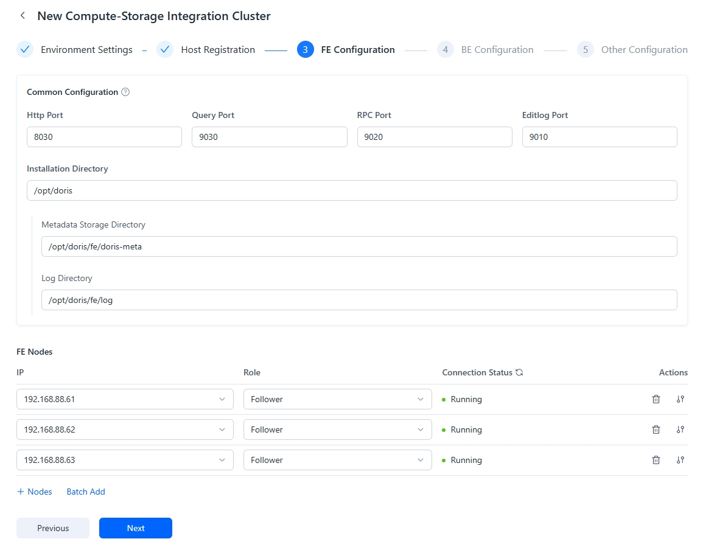
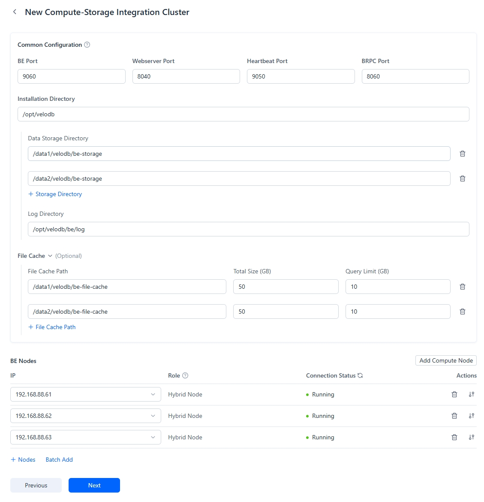

---
{
    "title": "Deploying an Integrated Storage-Compute Cluster",
    "description": "Through Manager, you can deploy Doris clusters on physical machines, virtual machines, and cloud servers, automatically completing environment checks..."
}
---

# Deploying an Integrated Storage-Compute Cluster

Through Manager, you can deploy Doris clusters on physical machines, virtual machines, and cloud servers, automatically completing environment checks and cluster configurations. To create a new integrated storage-compute cluster, go to the **Current Cluster** tab, select **Create/Manage Cluster**, and choose **Create Integrated Storage-Compute Cluster**.

## **Important Notes**

* You can deploy one FE and one BE on the same server, but you cannot deploy multiple FE or BE instances on a single server;
* Before deployment, you can refer to [Cluster Planning](https://doris.apache.org/docs/dev/install/preparation/cluster-planning) to calculate the number of nodes required;
* When adding machines, you must specify IP addresses rather than hostnames.

## Step 1: Environment Configuration

When configuring the cluster environment, you need to:
- Set the cluster name as prompted  
- Select the deployment version  
- Specify the database root password  

## Step 2: Host Registration

To register hosts:
1. Add host IPs and specify the Agent port  

     

   Both IPv4 and IPv6 formats are supported when adding host IPs.

2. Install Agent service on each host  

     

   The Agent installation requires checking machine parameters on each registered host and deploying the Agent service with one click.  

   After deployment, ensure the Agent status is "Normal" and refresh the Agent status.

## Step 3: FE Configuration  

  

When adding FEs:  
- Specify [FE roles](https://doris.apache.org/docs/dev/gettingStarted/what-is-apache-doris/#compute-storage-decoupled)  
- It's recommended to configure 3 FE Followers for high availability  

You can choose between:  
- General configuration (recommended for consistency)  
- Custom configuration for individual FEs  

Configuration parameters:  

| Parameter       | Description                                  |
|-----------------|--------------------------------------------|
| Http Port       | FE HTTP Server port (default: 8030)        |
| Query Port      | FE MySQL Server port (default: 9030)       |
| RPC Port        | FE Thrift Server port (must be consistent across FEs, default: 9020) |
| Editlog Port    | FE bdbje communication port (default: 9010) |
| Deployment Directory | Doris root deployment directory          |
| Metadata Directory | FE metadata storage directory            |
| Log Directory   | FE log directory                          |

## Step 4: BE Configuration  

  

When configuring BEs, choose between:  
- Standard Nodes (Hybrid Nodes): Handle both SQL queries and data storage  
- Compute Nodes: Process queries only (for federated query scenarios)  

Configuration parameters:  

| Parameter          | Description                                  |
|--------------------|--------------------------------------------|
| BE Port           | BE Thrift Server port (default: 9060)      |
| Webserver Port    | BE HTTP Server port (default: 8040)        |
| Heartbeat Port    | BE heartbeat service port (default: 9050)  |
| BRPC Port         | BE BRPC port for inter-BE communication (default: 8060) |
| Deployment Directory | Doris root deployment directory          |
| Data Directory    | BE data storage directory                  |
| Log Directory     | BE log directory                           |
| External Table Cache Directory | Federated analysis file cache directory |
| Total Cache Size  | Federated analysis file cache size         |
| Per-Query Cache Limit | Cache size limit for single federated queries |

## Step 5: Additional Configuration  

  

Configure cluster parameters:  
- Auto-restart option  
- Case sensitivity for table names  