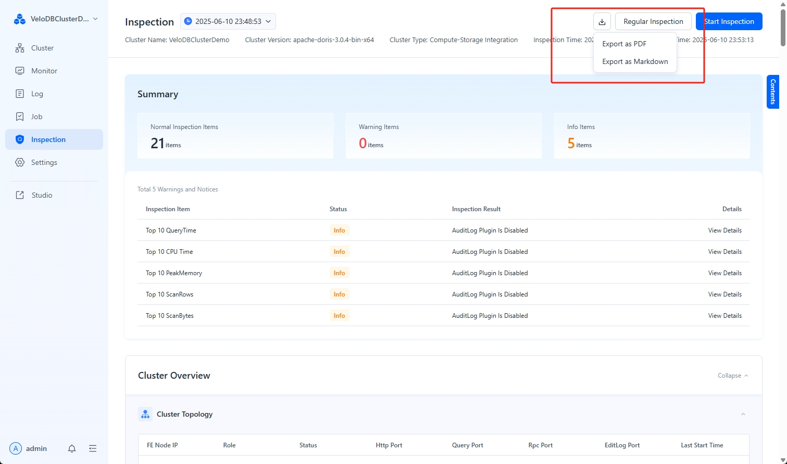
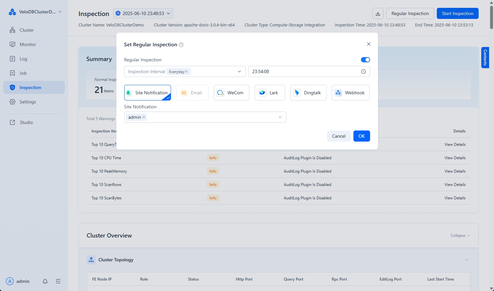

---
{
    "title": "Cluster Inspection",
    "description": "Manager includes a built-in cluster inspection feature that collects cluster/operating system information, checks data quality, and analyzes SQL perfo..."
}
---

# Cluster Inspection

Manager includes a built-in cluster inspection feature that collects cluster/operating system information, checks data quality, and analyzes SQL performance.

## Start Cluster Inspection

Navigate to the **Inspection** menu in the navigation bar and click **Inspect Now** to perform a cluster inspection.


Inspection anomaly statuses are categorized into three types:

* **Execution Failed**: The execution did not return a successful result, potentially due to permissions, machine environment settings, or cluster availability.
* **Warning**: This status indicates inspection items that might significantly impact the healthy operation of the cluster. Click **View Suggestions** to learn how to fix them.
* **Tip**: This status indicates inspection items that might have some impact or pose potential risks to the healthy operation of the cluster. Click **View Suggestions** to learn how to fix them.

Additionally, you can **Export** the inspection report as a PDF or Markdown file to your local machine.



## Enable Scheduled Inspection

The inspection feature supports scheduled inspections, allowing you to configure the inspection frequency and notification settings as needed.



## Add Custom Inspections

Manager supports extending inspection item functionality through custom scripts.

1.  **Modify the `user-defined-tasks.json` script**

    Add script extensions for inspection items in the `webserver/inspection/script/user-defined-tasks.json` file.

    For example, the following shows the addition of two custom inspection items: `CheckBadTablet` and `CheckSwapOff`:

    ```json
    {
      "tasks": [
        {
          "name": "CheckBadTablet",
          "source": "DORIS",
          "reason": "ensure tablets are all healthy.",
          "script": "CheckBadTablet.sh",
          "timeout": 600,
          "enabled": false
        },
        {
          "name": "CheckSwapOff",
          "source": "AGENT",
          "reason": "doris be requires swap off.",
          "script": "CheckSwapOff.sh",
          "timeout": 600,
          "enabled": true
        }
      ]
    }
    ```

    The parameters are described below:

    | Parameter | Meaning                                                                       |
    | :-------- | :---------------------------------------------------------------------------- |
    | `name`    | Inspection name, which will be displayed in the inspection report.            |
    | `source`  | Can be either `DORIS` or `AGENT`.                                             |
    | `script`  | Inspection script name. Ensure the script is located in the `webserver/inspection/script/` directory. |
    | `timeout` | Script execution timeout in seconds.                                          |
    | `enabled` | Whether the script is enabled. `true` means the inspection item is active.    |

2.  **Modify Custom Inspection Scripts**

    When creating custom scripts, the user running Manager must have execution permissions for the script. You can refer to the `agent_demo.sh` and `doris_demo.sh` script templates:

    * `agent_demo.sh`: An `AGENT` type script that executes shell commands on each agent machine.
    * `doris_demo.sh`: A `DORIS` type script that sends SQL commands to the Doris cluster.

3.  **Run Inspection and View Results**

    After adding custom inspection items, click the **Inspect Now** button. You can then view the results of your custom inspections at the end of the inspection report.