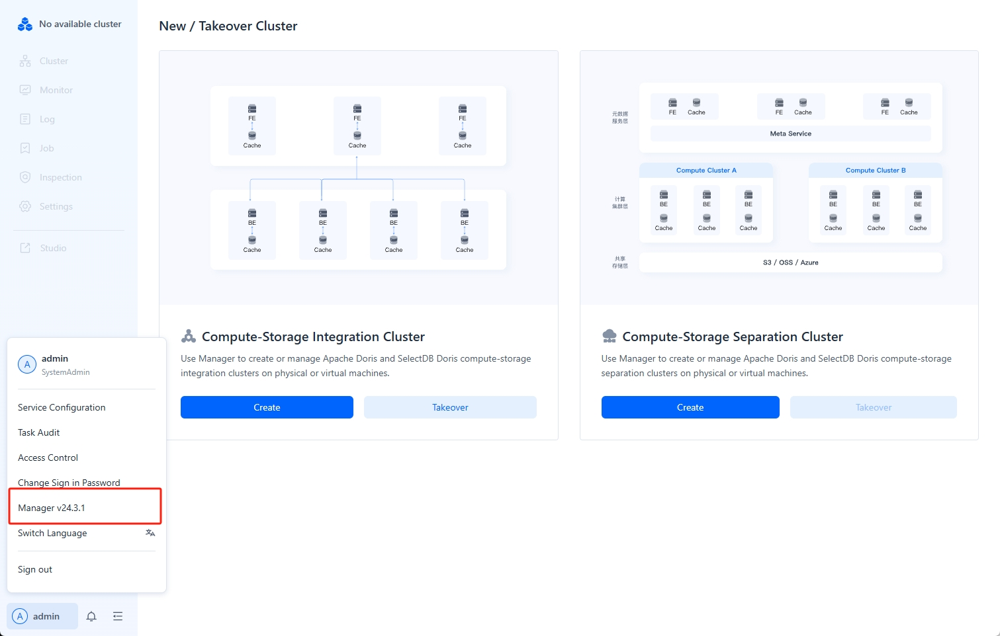
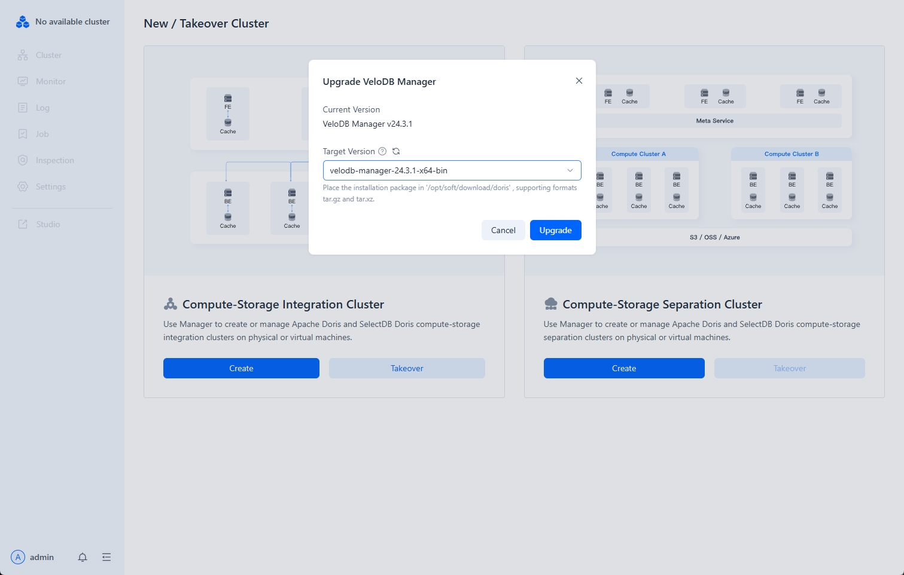

---
{
    "title": "Upgrading Manager",
    "description": "The Agent mode of Manager version 24.0.0 and later is incompatible with the SSH mode of version 23.X. If you need to upgrade from 23.X to 24."
}
---

# Upgrading Manager

The Agent mode of Manager version 24.0.0 and later is incompatible with the SSH mode of version 23.X. If you need to upgrade from 23.X to 24.X or higher, you must first uninstall version 23.X and then redeploy version 24.X. The following describes the upgrade method for version 24.X.

## Step 1: Check Current Version

1.  **Check Manager WebServer Version**

    Click on the user information at the bottom left to view the current Manager version.

    

2.  **Check Agent Version**

    Before and after upgrading, ensure that the WebServer version and Agent version are the same. You can view the Agent version on the host page:

    

## Step 2: Download New Version of Manager Installation Package

The upgrade page will prompt you for the storage path of the target version installation package on the Manager server. Click the upgrade button.

:::tip

Note:

During an upgrade, only the WebServer needs to be upgraded. The Agent version is checked during each heartbeat cycle, and if it's inconsistent with the WebServer version, it will automatically upgrade. After the upgrade, an `upgrade` directory will appear in the Agent deployment directory, backing up the information from before the upgrade.

:::

