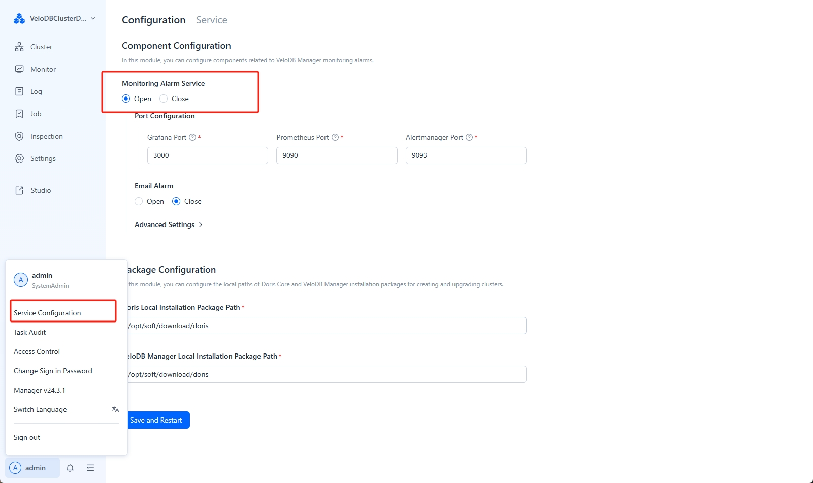

---
{
  "language": "ja"
}
---
FEおよびBEノードの起動に失敗した場合は、対応するDorisクラスタのログまたは出力ログを確認して、さらなるトラブルシューティングを行うことができます。

## クラスタ監視の管理

左下の**Service 構成**をクリックして、監視およびアラートサービスを有効または無効にします。



```sql
[root@r61 manager-agent]# tail -f log/supervise.log | grep 'start to supervise be node'
time="2025-04-10T05:01:17.546-04:00" level=debug msg="start to supervise be node [:9050]"
time="2025-04-10T05:01:32.546-04:00" level=debug msg="start to supervise be node [:9050]"
time="2025-04-10T05:01:47.546-04:00" level=debug msg="start to supervise be node [:9050]"
```
FEとBEノードの起動に失敗した場合は、対応するDorisクラスターログまたは出力ログを確認して、さらなるトラブルシューティングを行うことができます。

## クラスターモニタリングの管理

左下の**Service 構成**をクリックして、モニタリングとアラートサービスを有効または無効にします。


