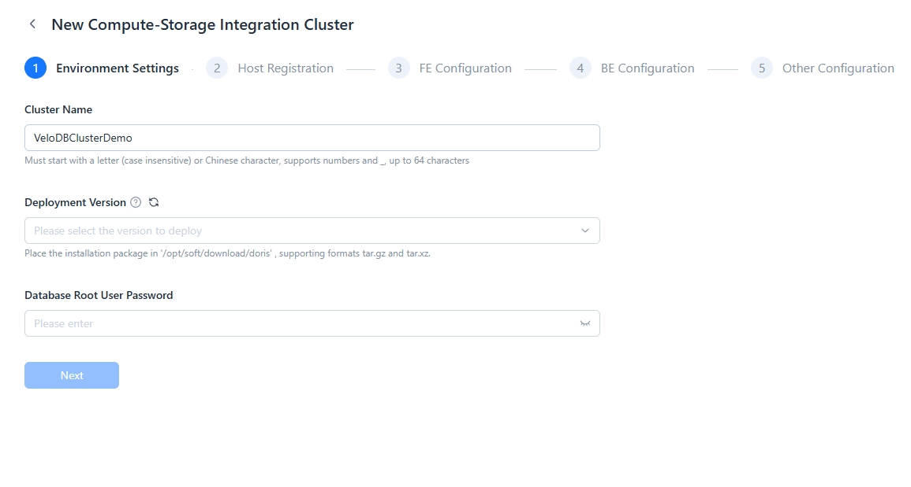
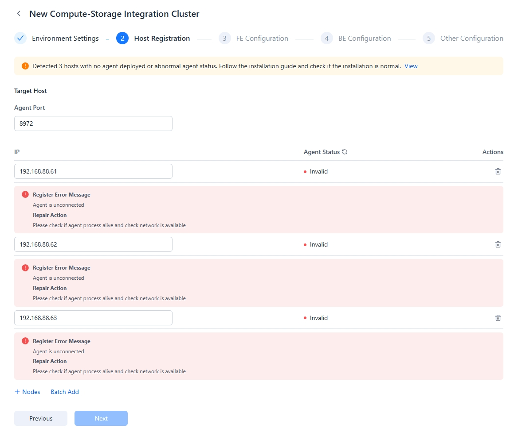
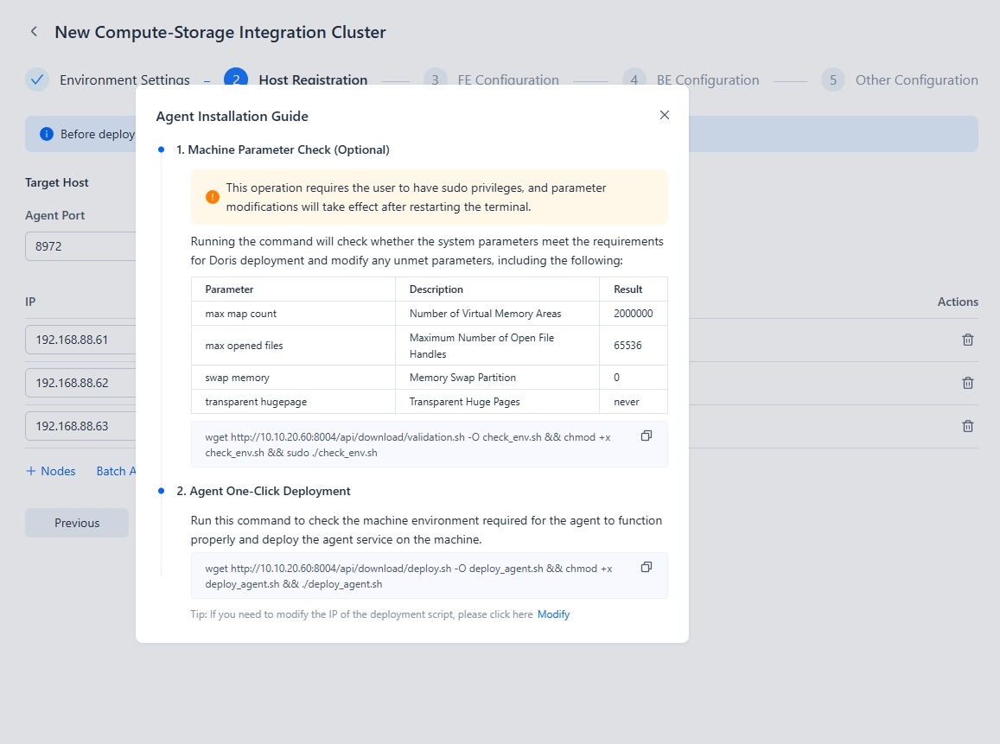
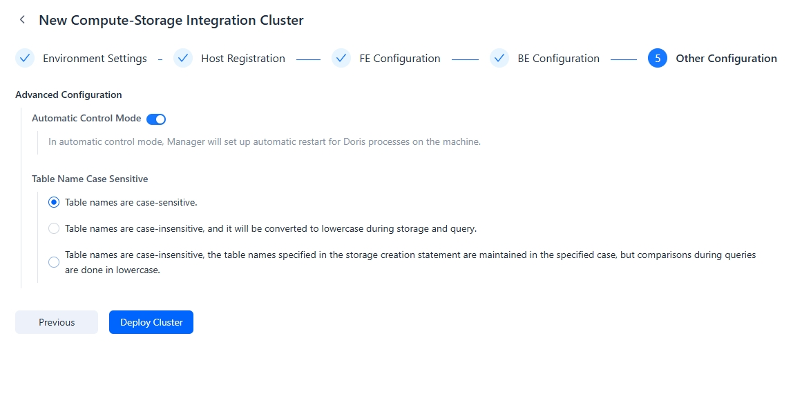

---
{
  "title": "Integrated Storage-Compute クラスターのデプロイ",
  "description": "Managerを通じて、物理マシン、仮想マシン、クラウドサーバー上にDorisクラスターをデプロイし、環境チェックを自動的に完了することができます...",
  "language": "ja"
}
---
# 統合ストレージ・コンピュートクラスターのデプロイ

Managerを通じて、物理マシン、仮想マシン、クラウドサーバー上にDorisクラスターをデプロイでき、環境チェックとクラスター設定を自動的に完了できます。新しい統合ストレージ・コンピュートクラスターを作成するには、**Current Cluster**タブに移動し、**Create/Manage Cluster**を選択して、**Create Integrated Storage-Compute Cluster**を選択してください。

## **重要な注意事項**

* 同じサーバー上に1つのFEと1つのBEをデプロイできますが、単一サーバー上に複数のFEまたはBEインスタンスをデプロイすることはできません。
* デプロイ前に、[Cluster Planning](https://doris.apache.org/docs/dev/install/preparation/cluster-planning)を参照して必要なノード数を計算できます。
* マシンを追加する際は、ホスト名ではなくIPアドレスを指定する必要があります。

## Step 1: 環境設定

クラスター環境を設定する際は、以下が必要です：
- プロンプトに従ってクラスター名を設定
- デプロイバージョンを選択
- データベースrootパスワードを指定

## Step 2: ホスト登録

ホストを登録するには：
1. ホストIPを追加し、Agentポートを指定

   

   ホストIPを追加する際、IPv4とIPv6の両方の形式がサポートされています。

2. 各ホストにAgentサービスをインストール

   

   Agentのインストールでは、登録された各ホストでマシンパラメータをチェックし、ワンクリックでAgentサービスをデプロイする必要があります。

   デプロイ後、Agentのステータスが「Normal」であることを確認し、Agentステータスを更新してください。

## Step 3: FE設定

FEを追加する際：
- [FEロール](https://doris.apache.org/docs/dev/gettingStarted/what-is-apache-doris/#compute-storage-decoupled)を指定
- 高可用性のために3つのFE Followerを設定することを推奨

以下から選択できます：
- 一般設定（一貫性のために推奨）
- 個別FE用のカスタム設定

設定パラメータ：

| パラメータ       | 説明                                  |
|-----------------|--------------------------------------------|
| Http Port       | FE HTTP Serverポート（デフォルト：8030）        |
| Query Port      | FE MySQL Serverポート（デフォルト：9030）       |
| RPC Port        | FE Thrift Serverポート（FE間で一致している必要があります、デフォルト：9020） |
| Editlog Port    | FE bdbje通信ポート（デフォルト：9010） |
| Deployment Directory | Dorisルートデプロイディレクトリ          |
| Metadata Directory | FEメタデータストレージディレクトリ            |
| Log Directory   | FEログディレクトリ                          |

## Step 4: BE設定

BEを設定する際、以下から選択できます：
- Standard Nodes（Hybrid Nodes）：SQLクエリとデータストレージの両方を処理
- Compute Nodes：クエリのみを処理（フェデレーテッドクエリシナリオ用）

設定パラメータ：

| パラメータ          | 説明                                  |
|--------------------|--------------------------------------------|
| BE Port           | BE Thrift Serverポート（デフォルト：9060）      |
| Webserver Port    | BE HTTP Serverポート（デフォルト：8040）        |
| Heartbeat Port    | BEハートビートサービスポート（デフォルト：9050）  |
| BRPC Port         | BE間通信用のBE BRPCポート（デフォルト：8060） |
| Deployment Directory | Dorisルートデプロイディレクトリ          |
| Data Directory    | BEデータストレージディレクトリ                  |
| Log Directory     | BEログディレクトリ                           |
| External Table Cache Directory | フェデレーテッド分析ファイルキャッシュディレクトリ |
| Total Cache Size  | フェデレーテッド分析ファイルキャッシュサイズ         |
| Per-Query Cache Limit | 単一フェデレーテッドクエリのキャッシュサイズ制限 |

## Step 5: 追加設定

クラスターパラメータを設定：
- 自動再起動オプション
- テーブル名の大文字小文字の区別
