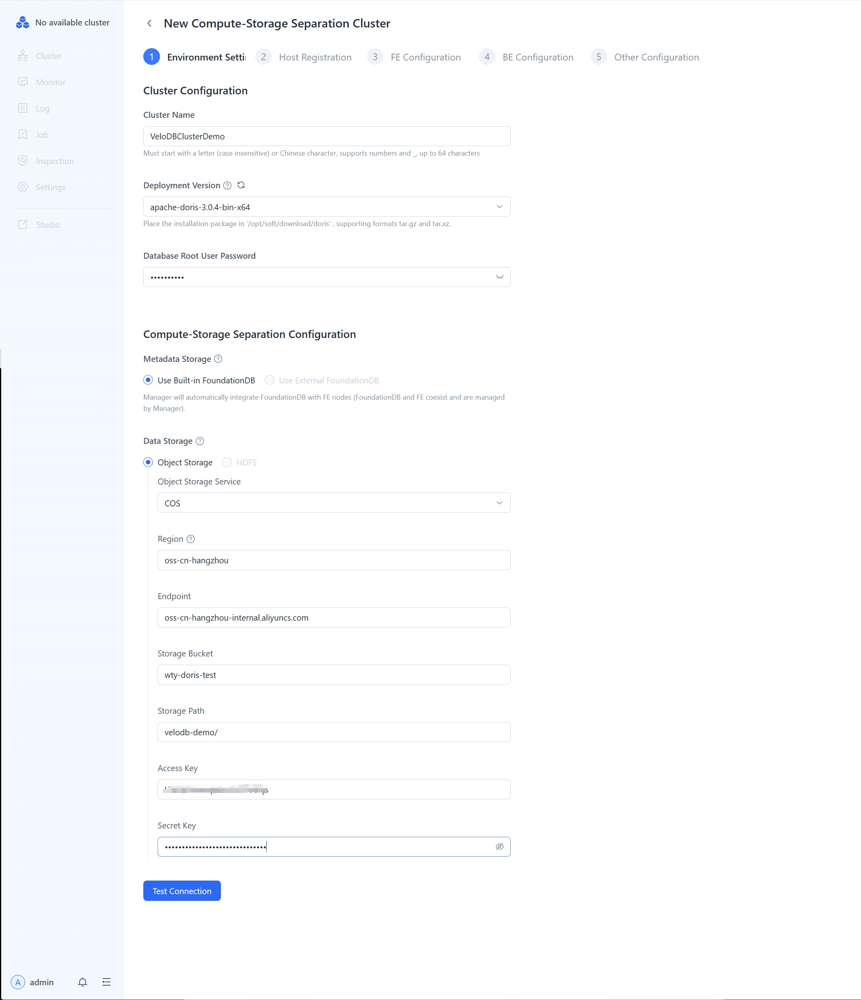
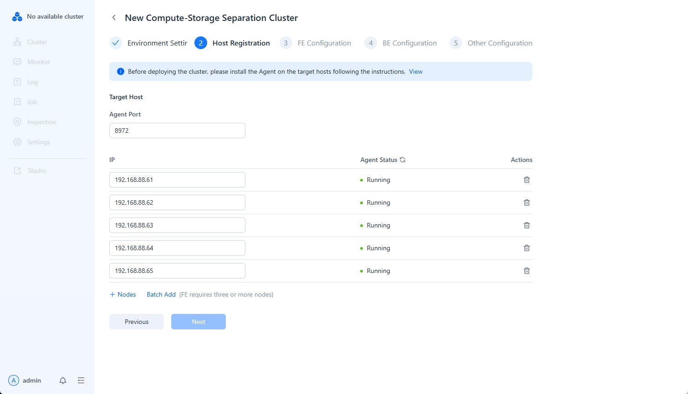
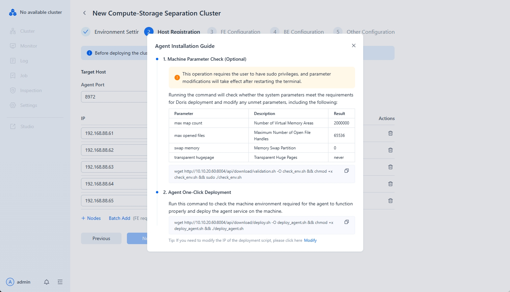
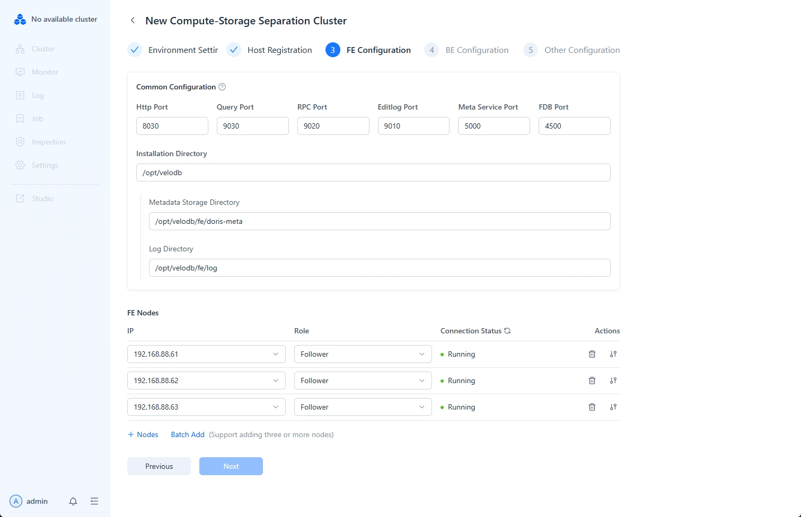
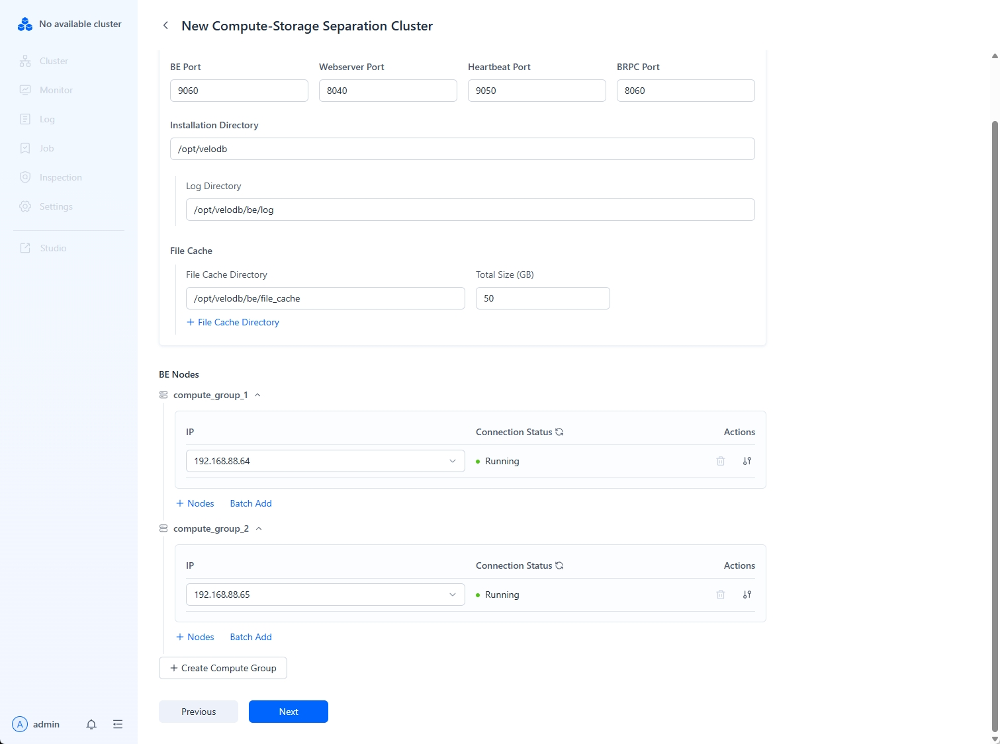
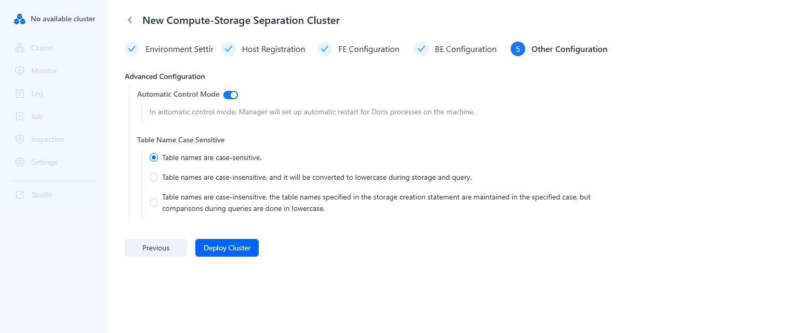

---
{
  "title": "Compute-Storage分離クラスターのデプロイ",
  "description": "Managerを使用すると、物理マシン、仮想マシン、クラウドサーバー上にDorisクラスターをデプロイでき、環境チェックを自動的に実行します...",
  "language": "ja"
}
---
# Compute-Storage分離クラスターのデプロイ

Managerを使用すると、物理マシン、仮想マシン、クラウドサーバー上にDorisクラスターをデプロイでき、環境チェックとクラスター設定を自動実行します。新しいcompute-storage分離クラスターを作成するには、**Current Cluster**タブの**New/Take Over Cluster**を選択し、**Create Compute-Storage Separated Cluster**を選択します。

## 注意事項

* FEマシンはFoundationDBを同時にデプロイし、最低48GBのメモリが必要です。
* 1つのサーバーに1つのFEと1つのBEを混在デプロイできますが、複数のFEとBEインスタンスをデプロイすることはできません。
* デプロイ前に、[Cluster Planning](https://doris.apache.org/zh-CN/docs/dev/install/preparation/cluster-planning)を参照してノード数を見積もることができます。
* マシンを追加する際は、ホスト名ではなく**IPアドレス**を指定する必要があります。

## Step 1: 環境設定

クラスター環境を設定する際は、クラスター名を設定し、デプロイバージョンを選択し、プロンプトに従ってデータベースのrootパスワードを指定する必要があります。

また、compute-storage分離クラスター用の共有ストレージを設定する必要があります。

## Step 2: ホスト登録

ホストを登録する際は、まずホストIPを追加し、次に各ホストのAgentサービスを開始する必要があります。

1.  **ホストIPの追加とAgentポートの指定**

    

    ホストIPを追加する際は、IPV4とIPV6の両方の形式がサポートされています。

2.  **指定されたホストへのAgentサービスのインストール**

    

    Agentのインストールでは、各登録ホストでマシンパラメータをチェックし、Agentサービスをワンクリックでデプロイする必要があります。

    Agentサービスをデプロイした後、Agentのステータスが正常であることを確認してください。

## Step 3: FE設定

FEを追加する際は、[FE Role](https://doris.apache.org/zh-CN/docs/dev/gettingStarted/what-is-apache-doris#%E5%AD%98%E7%AE%97%E4%B8%80%E4%BD%93%E6%9E%B6%E6%9E%84)を指定する必要があります。高可用性アーキテクチャを形成するために、3つのFE Followerを指定することを推奨します。

FE設定を指定する際は、一般設定を選択するか、特定のFE設定を個別に変更できます。一貫したFE設定を確保するため、一般設定の使用を推奨します。

設定の説明は以下の通りです：

| Parameter        | Description                                                                     |
| :--------------- | :------------------------------------------------------------------------------ |
| Http Port        | FEのHTTP Serverポート、デフォルト8030                                            |
| Query Port       | FEのMySQL Serverポート、デフォルト9030                                           |
| RPC Port         | FEのThrift Serverポート、各FEの設定は一致している必要があります、デフォルト9020 |
| Editlog Port     | FEのbdbje通信ポート、デフォルト9010                                    |
| Deployment Directory | Dorisデプロイのルートディレクトリ                                                 |
| Metadata Storage Directory | FEメタデータストレージディレクトリ                                                 |
| Log Directory    | FEログディレクトリ                                                                |

## Step 4: BE設定

BEノードを追加する際は、まずcomputeグループを計画し、次に各computeグループにBEノードを追加する必要があります。

上の図に示すように、2つのリソースグループが作成され、各リソースグループに1つのBEノードが追加されています。

設定の説明は以下の通りです：

| Parameter          | Description                                                                     |
| :----------------- | :------------------------------------------------------------------------------ |
| BE Port            | BEのThrift Serverポート、FEからのリクエストを受信するために使用、デフォルト9060        |
| Webserver Port     | BEのHTTP Serverポート、デフォルト8040                                            |
| Heartbeat Port     | BEのハートビートサービスポート（Thrift）、FEからのハートビートを受信するために使用、デフォルト9050 |
| BRPC Port          | BEのBRPCポート、BE間の通信に使用、デフォルト8060               |
| Deployment Directory | Dorisデプロイのルートディレクトリ                                                 |
| Data Storage Directory | BEデータストレージディレクトリ                                                       |
| Log Directory      | BEログストレージディレクトリ                                                        |
| External Table Cache Directory | Federal analysisファイルキャッシュディレクトリ                                           |
| Total File Cache Size | Federal analysisファイルキャッシュサイズ                                                |
| Single Query Cache Limit | Federal analysis単一クエリキャッシュサイズ制限                                  |

## Step 5: その他の設定

クラスターパラメータを設定する際は、サービスを自動的に開始するかどうか、およびテーブル名の大文字小文字を区別するかどうかを選択できます。
