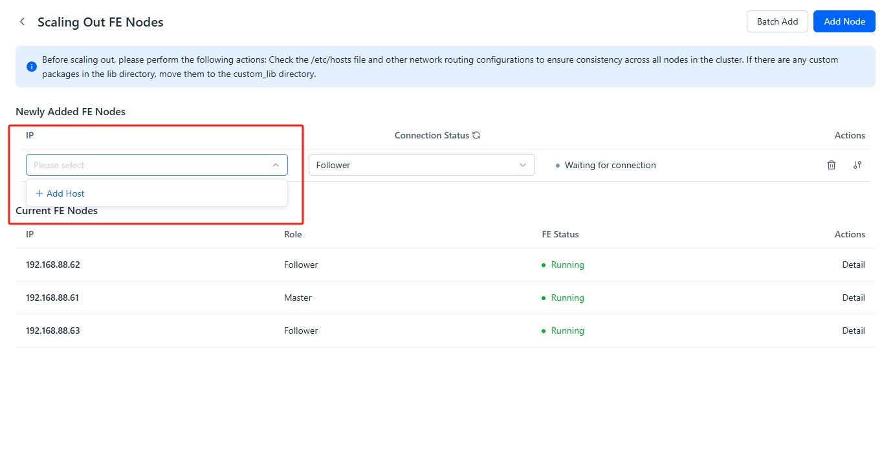
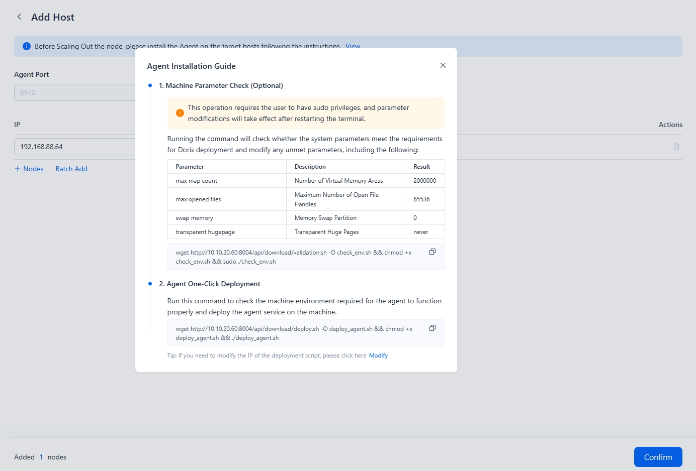
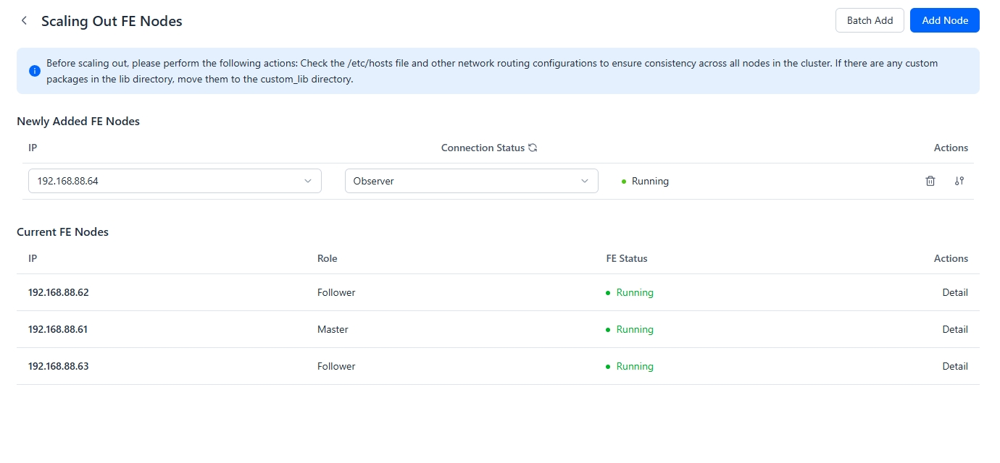
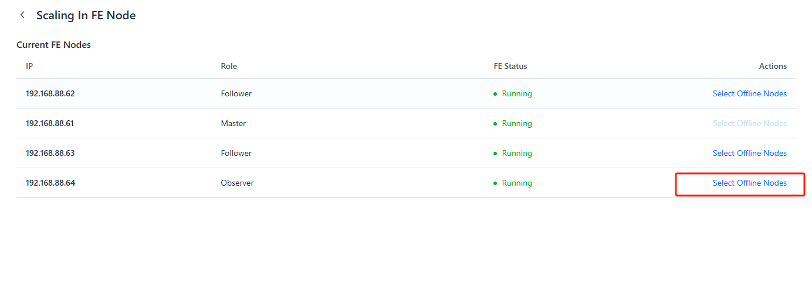
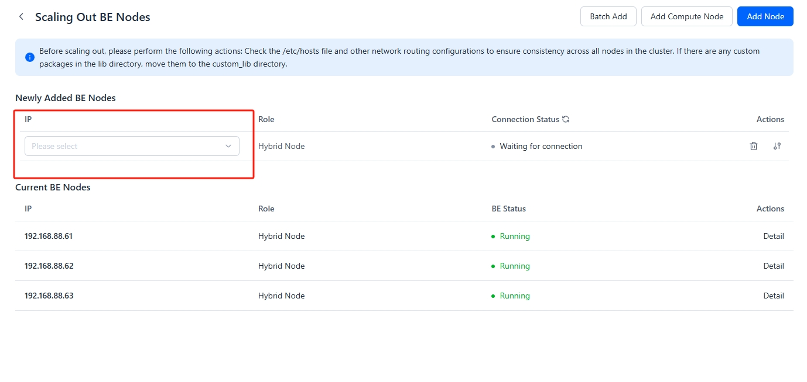
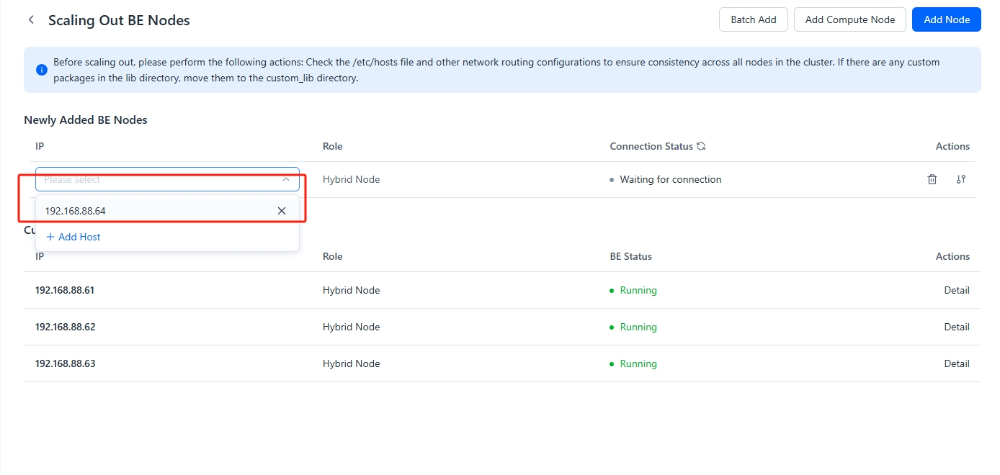
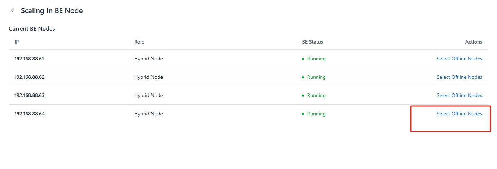

---
{
  "title": "Compute-Storage統合クラスターのスケールアウト/イン",
  "description": "Managerはクラスターのスケールアウトとスケールインをサポートしています。これらの操作は、クラスターページの「Cluster Scale」をクリックすることで実行できます。",
  "language": "ja"
}
---
# Scale Out/In Compute-Storage Integrated Cluster

Managerはクラスターのスケールアウトとスケールインをサポートしています。これらの操作は、クラスターページの「Cluster Scale」をクリックして実行できます。

## 注意事項

## Scale Out FE

**ステップ 1: Add Hosts**

「Cluster Scale」ボタンをクリックし、「Scale Out FE Node」を選択します。

クラスターページで「Add Node」を選択した後、IPドロップダウンボックスから「Add Host」を選択します。複数のホストを追加できます。

**ステップ 2: Deploy エージェント for Hosts**

プロンプトに従って、ホスト用のagentサービスをインストールします。すべてのホストのAgentステータスが正常であることを確認してください。

**ステップ 3: Add FE Nodes**

追加するホストを選択し、FEノードのロールを選択します。この例では、3つの高可用性Followerノードが既に存在しているため、新しいFEのロールとして「Observer」を選択します。

## Scale In FE

「Cluster Scale」ボタンをクリックし、「Scale In FE Node」を選択して、廃止するノードを選択します。例えば、この例では、廃止対象としてObserverノードが選択されています。

## Scale Out BE

**ステップ 1: Add Hosts**

「Cluster Scale」ボタンをクリックし、「Scale Out BE Node」を選択します。

クラスターページで「Add Node」を選択した後、IPドロップダウンボックスから「Add Host」を選択します。複数のホストを追加できます。

**ステップ 2: Deploy エージェント for Hosts**

プロンプトに従って、ホスト用のagentサービスをインストールします。すべてのホストのAgentステータスが正常であることを確認してください。

**ステップ 3: Add BE Nodes**

追加するホストを選択します。BEノードは標準ノードまたはcomputeノードとして登録できます。

## Scale In BE

「Cluster Scale」ボタンをクリックし、「Scale In BE Node」を選択して、廃止するノードを選択します。

