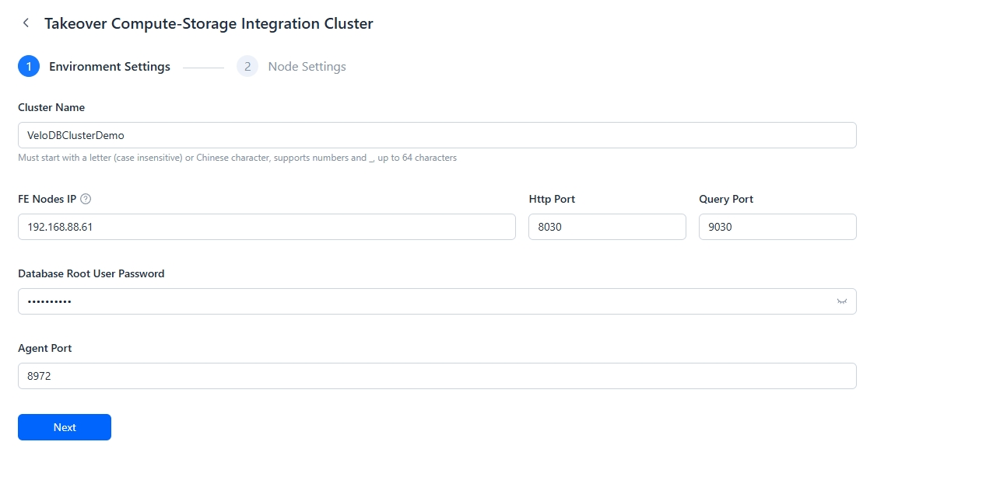
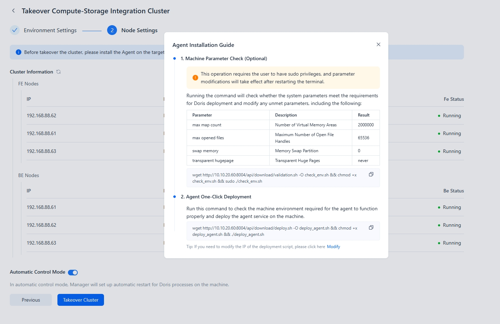

---
{
  "title": "Compute-Storage統合クラスターの引き継ぎ",
  "description": "Managerは既にデプロイ済みのDorisクラスターを管理できます。",
  "language": "ja"
}
---
# Compute-Storage Integrated Clusterの引き継ぎ

ManagerはすでにデプロイされたDorisクラスターを管理できます。引き継ぎ後、Managerプラットフォームを通じて監視、スケーリング、再起動などのクラスター操作を実行できます。

## ステップ1: 環境設定

クラスターを引き継ぐ際、利用可能なFEの情報とクラスターのrootユーザーパスワードを提供する必要があります。

:::tip
注意：

FEプロキシを有効にする必要がある場合、設定メニューでFE代表IPとFEプロキシアドレスを入力する必要があります。

:::

## ステップ2: ノード設定

ノードを設定する際、クラスターノードとAgentのステータスが正常であることを確認してください。Agentインストールのガイドを参照できます。

ステータスが正常であることを確認後、「Take Over Cluster」をクリックしてください。

:::tip

注意：

クラスター引き継ぎ時に「auto-start」機能を選択する場合、まずクラスターの以前の自動起動管理（例：systemdやsupervisor）を無効にする必要があります。その後、Managerが自動起動管理を引き継ぎ、競合を防止します。

:::

