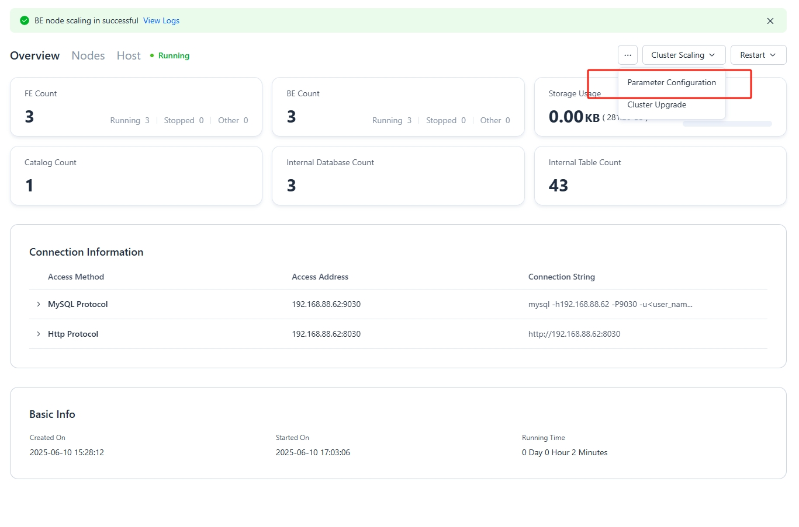
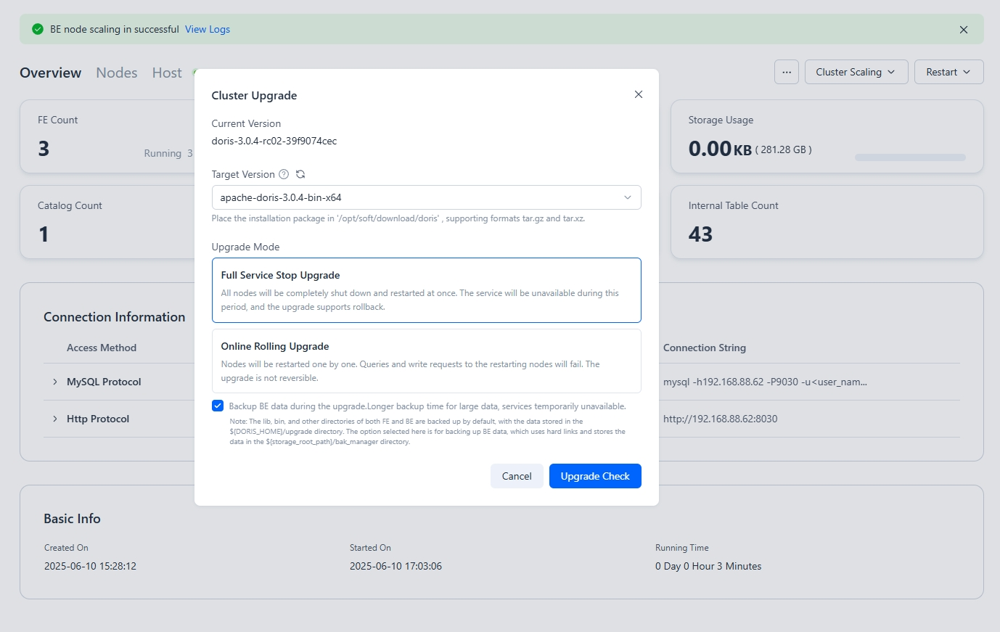
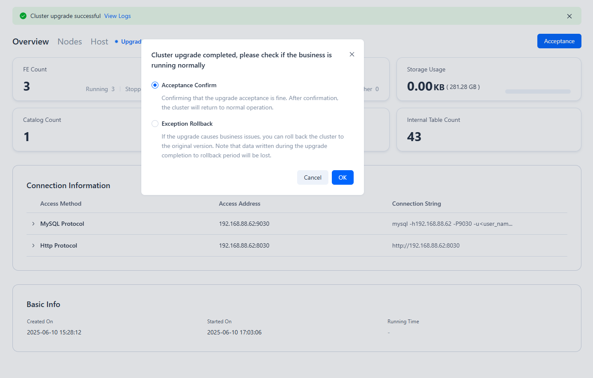
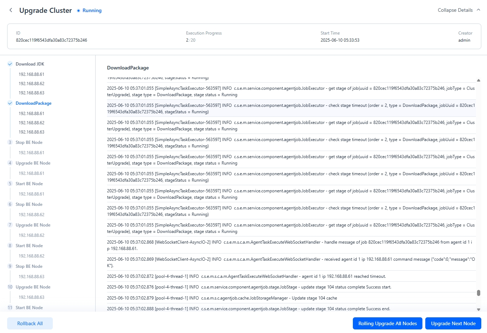

---
{
  "title": "Compute-Storage Integrated Cluster のアップグレード",
  "description": "Managerはクラスターのアップグレードをサポートし、2つのアップグレードモードを提供します：完全ダウンタイムアップグレードとオンラインローリングアップグレード。",
  "language": "ja"
}
---
# Compute-Storage統合クラスタのアップグレード

Managerはクラスタのアップグレードをサポートし、完全ダウンタイムアップグレードとオンラインローリングアップグレードの2つのアップグレードモードを提供します。クラスタページで右上のドロップダウンメニューから**Cluster Upgrade**をクリックし、ターゲットアップグレードバージョンとアップグレードモードを選択してクラスタアップグレード操作を実行します。

## アップグレードの注意事項

* 完全アップグレード中は、データのバックアップを選択できます。クラスタに大量のデータがある場合、バックアップに時間がかかる可能性があり、その間サービスは利用できません。
* ローリングアップグレード中はデータをバックアップできません。ローリングアップグレードは二桁バージョンにはロールバックできませんが、三桁バージョンにはロールバックできます。

## ステップ1: Upgrade Clusterをクリック

**Cluster - Nodes**ページで、右上のドロップダウンメニューから「Cluster Upgrade」を選択します。

## ステップ2: アップグレードモードを選択

クラスタをアップグレードする際、完全ダウンタイムアップグレードとオンラインローリングアップグレードから選択できます：

| アップグレード方法      | クラスタ可用性                                                 | ロールバックサポート                  |
| :------------------ | :------------------------------------------------------------------- | :-------------------------------- |
| Full Downtime Upgrade | クラスタは利用不可                                               | データバックアップをサポート；バックアップ後にロールバック可能 |
| Online Rolling Upgrade | クラスタは利用可能だが、ローリング再起動中のノードは読み書きリクエストの失敗を引き起こし、アプリケーションクライアントでの再試行が必要 | データバックアップをサポートしない；ロールバック不可  |

データバックアップが選択された場合、FEまたはBEルートディレクトリ下の`upgrade`ディレクトリに保存されます。このディレクトリは、クラスタが正常にアップグレードされたことを確認後に削除できます。

## ステップ3: アップグレードの検証

**完全ダウンタイムアップグレードの検証**

完全ダウンタイムアップグレードはロールバックをサポートします。完全ダウンタイムアップグレード後、完了したクラスタをチェックでき、異常が発見された場合はロールバック操作を実行できます。

**オンラインローリングアップグレードの検証**

オンラインローリングアップグレード中は、まず単一ノードをアップグレードできます。単一ノードのアップグレードが完了したら、残りのすべてのノードのローリングアップグレードを実行できます。

