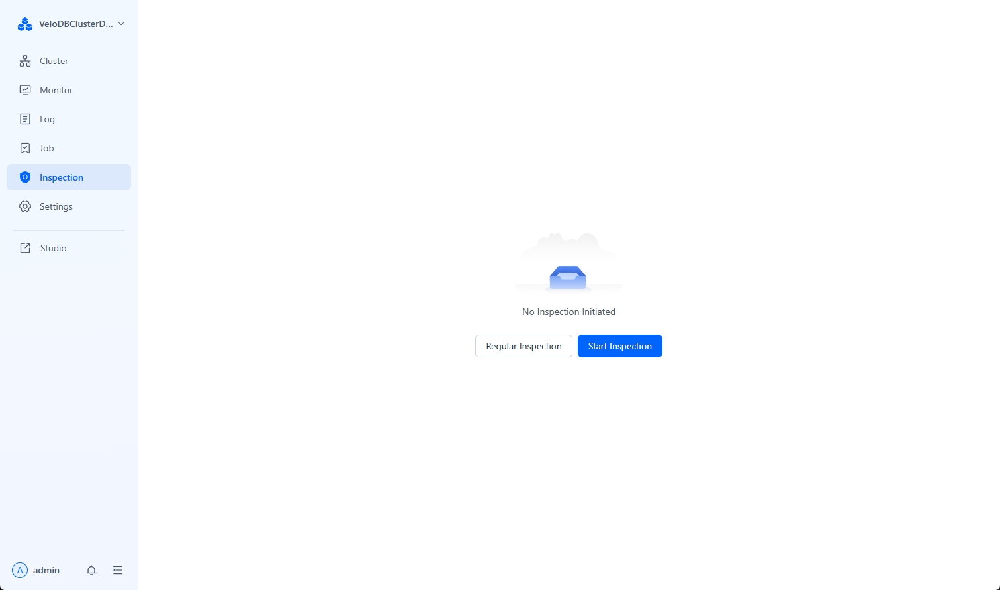

---
{
  "title": "クラスターの検査",
  "description": "Managerには、クラスター/オペレーティングシステム情報を収集し、データ品質をチェックし、SQLパフォーマンスを分析する組み込みクラスター検査機能が含まれています...",
  "language": "ja"
}
---
# Cluster Inspection

Manager には、クラスター/オペレーティングシステム情報を収集し、データ品質をチェックし、SQL パフォーマンスを分析する組み込みのクラスター検査機能が含まれています。

## Cluster Inspection の開始

ナビゲーションバーの **Inspection** メニューに移動し、**Inspect Now** をクリックしてクラスター検査を実行します。



検査の異常ステータスは3つのタイプに分類されます：

* **Execution Failed**: 実行が正常な結果を返さなかった場合で、権限、マシン環境設定、またはクラスターの可用性が原因の可能性があります。
* **Warning**: このステータスは、クラスターの健全な動作に大きな影響を与える可能性がある検査項目を示します。修正方法を確認するには **View Suggestions** をクリックしてください。
* **Tip**: このステータスは、クラスターの健全な動作に何らかの影響を与えたり、潜在的なリスクをもたらす可能性がある検査項目を示します。修正方法を確認するには **View Suggestions** をクリックしてください。

さらに、検査レポートを PDF または Markdown ファイルとしてローカルマシンに **Export** することができます。


## スケジュール検査の有効化

検査機能はスケジュール検査をサポートしており、必要に応じて検査頻度と通知設定を構成することができます。


## カスタム検査の追加

Manager は、カスタムスクリプトを通じて検査項目機能の拡張をサポートしています。

1.  **`user-defined-tasks.json` スクリプトの変更**

    `webserver/inspection/script/user-defined-tasks.json` ファイルに検査項目のスクリプト拡張を追加します。

    例えば、以下は2つのカスタム検査項目 `CheckBadTablet` と `CheckSwapOff` の追加を示しています：

    ```json
    {
      "tasks": [
        {
          "name": "CheckBadTablet",
          "source": "DORIS",
          "reason": "ensure tablets are all healthy.",
          "script": "CheckBadTablet.sh",
          "timeout": 600,
          "enabled": false
        },
        {
          "name": "CheckSwapOff",
          "source": "AGENT",
          "reason": "doris be requires swap off.",
          "script": "CheckSwapOff.sh",
          "timeout": 600,
          "enabled": true
        }
      ]
    }
    ```
パラメータの説明は以下の通りです:

    | Parameter | Meaning                                                                       |
    | :-------- | :---------------------------------------------------------------------------- |
    | `name`    | インスペクション名。インスペクションレポートに表示されます。            |
    | `source`  | `DORIS` または `AGENT` のいずれかを指定できます。                                             |
    | `script`  | インスペクションスクリプト名。スクリプトが `webserver/inspection/script/` ディレクトリに配置されていることを確認してください。 |
    | `timeout` | スクリプト実行のタイムアウト時間（秒）。                                          |
    | `enabled` | スクリプトが有効かどうか。`true` はインスペクション項目がアクティブであることを意味します。    |

2.  **カスタムインスペクションスクリプトの変更**

    カスタムスクリプトを作成する際、Manager を実行するユーザーはそのスクリプトに対する実行権限を持っている必要があります。`agent_demo.sh` と `doris_demo.sh` のスクリプトテンプレートを参照できます:

    * `agent_demo.sh`: 各エージェントマシンでシェルコマンドを実行する `AGENT` タイプのスクリプト。
    * `doris_demo.sh`: Doris クラスターに SQL コマンドを送信する `DORIS` タイプのスクリプト。

3.  **インスペクションの実行と結果の確認**

    カスタムインスペクション項目を追加した後、**Inspect Now** ボタンをクリックします。その後、インスペクションレポートの最後でカスタムインスペクションの結果を確認できます。
