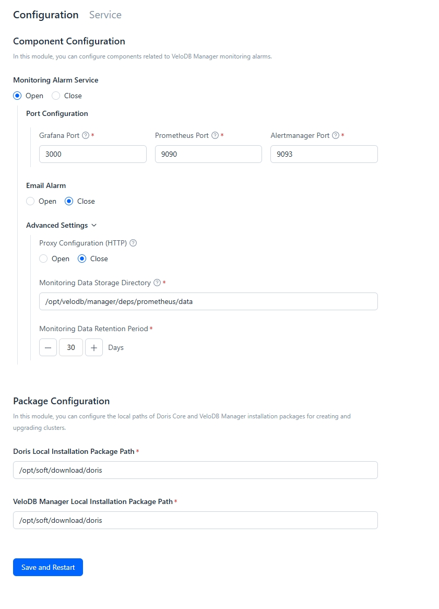

---
{
  "title": "Manager のデプロイ",
  "description": "Manager インストールパッケージを展開します。",
  "language": "ja"
}
---
# Managerのデプロイ

## ステップ1: インストールパッケージのダウンロード

Managerのインストールパッケージを展開してください。

パッケージのディレクトリ構造は以下の通りです：

```shell
├── agent        ## anget directory
│   ├── install.sh                              
│   ├── manager-agent-24.2.0-x64-bin.tar.gz     
│   └── validation.sh                           
├── deps        ## Third-Party Dependency Directory
│   ├── alertmanager                            
│   ├── foundationdb-7.1.38.tar.gz
│   ├── grafana
│   ├── jdk
│   ├── jdk17
│   ├── prometheus
│   └── webui
├── LICENSE
└── webserver    ## WebServer directory 
    ├── bin
    ├── conf
    ├── config-tool
    ├── inspection
    ├── lib
    └── static

```
## Step 2: WebServerコンポーネントを開始する

1. **インストールディレクトリを変更する**

   適切なインストールディレクトリを選択してください。この例では、展開されたパッケージを /opt/doris/manager に移動します：

   ```sql
   mv ./doris-manager-24.2.0-x64-bin /opt/doris/manager
   ```
2. **WebServerサービスの設定（オプション）**

   WebServerサービスを設定するために`webserver/conf/manager.conf`ファイルを修正します。設定パラメータは以下の通りです：

   | パラメータ                          | デフォルト | 説明                                                                 |
   | ---------------------------------- | ------- | --------------------------------------------------------------------------- |
   | MANAGER_PORT                       | 8004    | Manager Webサービスコンポーネントのポート                                |
   | DB_TYPE                            | h2      | サポートされるデータベースタイプ：mysql、h2またはpostgresql                          |
   | DATA_PATH                          | ../data | Managerメタデータストレージパス（DB_TYPEがh2の場合のみ有効）           |
   | DB_HOST                            | -       | データベースアクセスアドレス（mysql/postgresqlの場合のみ有効）               |
   | DB_PORT                            | -       | データベースアクセスポート（mysql/postgresqlの場合のみ有効）                 |
   | DB_USER                            | -       | データベースアクセスユーザー名（mysql/postgresqlの場合のみ有効）             |
   | DB_PASS                            | -       | データベースアクセスパスワード（mysql/postgresqlの場合のみ有効）             |
   | DB_DBNAME                          | -       | データベース名（mysql/postgresqlの場合のみ有効）                        |
   | DB_URL_SUFFIX                      | -       | MySQLデータベース接続URL接尾辞                                       |
   | HTTP_CONNECT_TIMEOUT               | 30      | HTTPハンドシェイクタイムアウト（秒）                                        |
   | HTTP_SOCKET_TIMEOUT                | 60      | HTTPレスポンス受信タイムアウト（秒）                                 |
   | LISTEN_PROTOCOL                    | ALL     | サービスリスニング用IPプロトコル：ALL、IPV4またはIPV6（ALLは両方を意味する）      |
   | FE_MIN_DISK_SPACE_FOR_UPGRADE      | 10      | アップグレード時のFEモジュールインストールパスの最小空きディスク容量（GB） |
   | BE_MIN_DISK_SPACE_FOR_UPGRADE      | 10      | アップグレード時のBEモジュールインストールパスの最小空きディスク容量（GB） |

3. **WebServerサービスの開始**

   以下のコマンドを使用してWebServerサービスを開始します。開始後、MANAGER_PORTのステータス（デフォルトは8004）を確認してください：

   ```sql
   webserver/bin/start.sh
   ```
## Step 3: WebServer経由でManagerを起動

ブラウザでhttp://{webserver-ip}:{manager-port}を開き、WebServerサービスにアクセスします。

1.  **Manager管理者アカウントの初期化**

    初回のWebサービスアクセス時、ユーザー初期化ページに入ります。ここで最初のManager管理者ユーザーを作成してください。

    Manager管理者アカウントはクラスターアカウントとは独立しており、Managerのアクセス制御にのみ使用されます。

2.  **サービスコンポーネントデプロイ情報の設定**

    以下のページでサービス情報を設定できます：

    

    設定の説明は以下の通りです：

    | 設定項目           | 説明                                                                                                                                                                                                                                                                |
    | :---------------------- | :------------------------------------------------------------------------------------------------------------------------------------------------------------------------------------------------------------------------------------------------------------------------- |
    | Monitoring and Alerting Service | オプション。Managerのモニタリングおよびアラートモジュールを設定するために使用されます。これによりGrafana、Prometheus、およびAlertmanagerがインストールされます。Managerがインストールされているマシン上で3つの利用可能なポートを選択する必要があります。                                                              |
    | Email Alerting          | メールサーバーを設定します。設定後、アラートに「Email Alerting」チャンネルを使用できます。                                                                                                                                                                                            |
    | Proxy Configuration     | 本番環境が外部ネットワークから分離されている場合、パブリックオフィス通信ソフトウェアへ通知を送信するためのプロキシを設定できます。                                                                                                                                                                                                             |
    | Installation Package Configuration | 新しいクラスターの作成と既存クラスターのアップグレードに使用される、Doris CoreおよびManagerインストールパッケージのローカルストレージパスを設定します。 |
