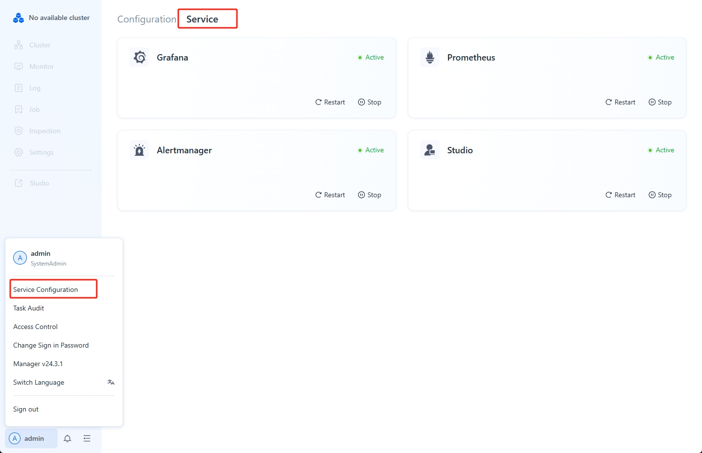

---
{
  "title": "Uninstall Manager",
  "description": "Managerをアンインストールすると、Managerの制御メタデータと監視情報が失われるため、注意して進めてください。",
  "language": "ja"
}
---
# Uninstall Manager

Managerをアンインストールすると、Managerの制御メタデータと監視情報が失われるため、注意して実行してください。Managerをアンインストールしても、Dorisクラスターの通常の動作には影響しません。コマンドラインやその他の方法でDorisクラスターを引き続き管理できます。

## ステップ 1: Non-WebServerサービスの停止

左下のユーザー設定ページで「Service 構成」をクリックし、「Services」メニューを選択して、すべてのサービスを停止します。



## ステップ 2: WebServerサービスの停止

1.  **WebServerサービスの停止**

    managerのデプロイメントディレクトリに移動します。以下のコマンドを実行した後、インストールパスを削除できます：

    ```sql
    webserver/bin/stop.sh
    ```
2.  **ノード上のAgentを停止**

    Agentインストールディレクトリで、以下のコマンドを実行してインストールパスを削除します：

    ```sql
    bin/stop.sh
    ```
