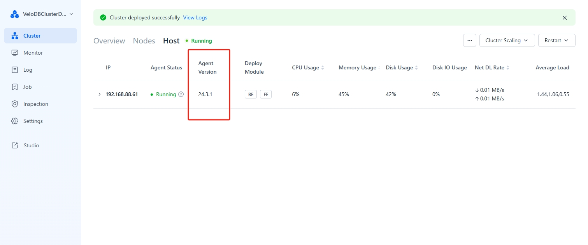

---
{
  "title": "Manager のアップグレード",
  "description": "Manager バージョン 24.0.0 以降の Agent モードは、バージョン 23.X の SSH モードと互換性がありません。23.X から 24 にアップグレードする必要がある場合",
  "language": "ja"
}
---
# Manager のアップグレード

Manager バージョン24.0.0以降のAgentモードは、バージョン23.XのSSHモードと互換性がありません。23.Xから24.X以降にアップグレードする必要がある場合は、まずバージョン23.Xをアンインストールしてから、バージョン24.Xを再デプロイする必要があります。以下では、バージョン24.Xのアップグレード方法について説明します。

## ステップ1: 現在のバージョンを確認

1.  **Manager WebServerバージョンの確認**

    左下のユーザー情報をクリックして、現在のManagerバージョンを表示します。

    

2.  **Agentバージョンの確認**

    アップグレードの前後で、WebServerバージョンとAgentバージョンが同じであることを確認してください。Agentバージョンはホストページで確認できます：

    

## ステップ2: Managerインストールパッケージの新バージョンをダウンロード

アップグレードページで、Managerサーバー上のターゲットバージョンインストールパッケージの保存パスの入力が求められます。アップグレードボタンをクリックしてください。

:::tip

注意：

アップグレード中は、WebServerのみをアップグレードする必要があります。Agentバージョンは各ハートビートサイクルで確認され、WebServerバージョンと一致しない場合は自動的にアップグレードされます。アップグレード後、Agentデプロイメントディレクトリに`upgrade`ディレクトリが表示され、アップグレード前の情報がバックアップされます。

:::

