---
{
  "title": "Doris Cluster アラート",
  "description": "アラートモジュールでは、アラートポリシーを設定できます。ビジネスニーズに基づいてアラート項目を作成するには、「Create New Alert Policy」を選択してください。",
  "language": "ja"
}
---
# Doris Cluster アラート

## クラスターアラート項目

アラートモジュールでは、アラートポリシーを設定できます。「Create New Alert Policy」を選択して、ビジネスニーズに基づいてアラート項目を作成します。下の画像に示すように、FE用のアラートポリシーが作成されており、FEがダウンした場合、アラート通知が送信されます。

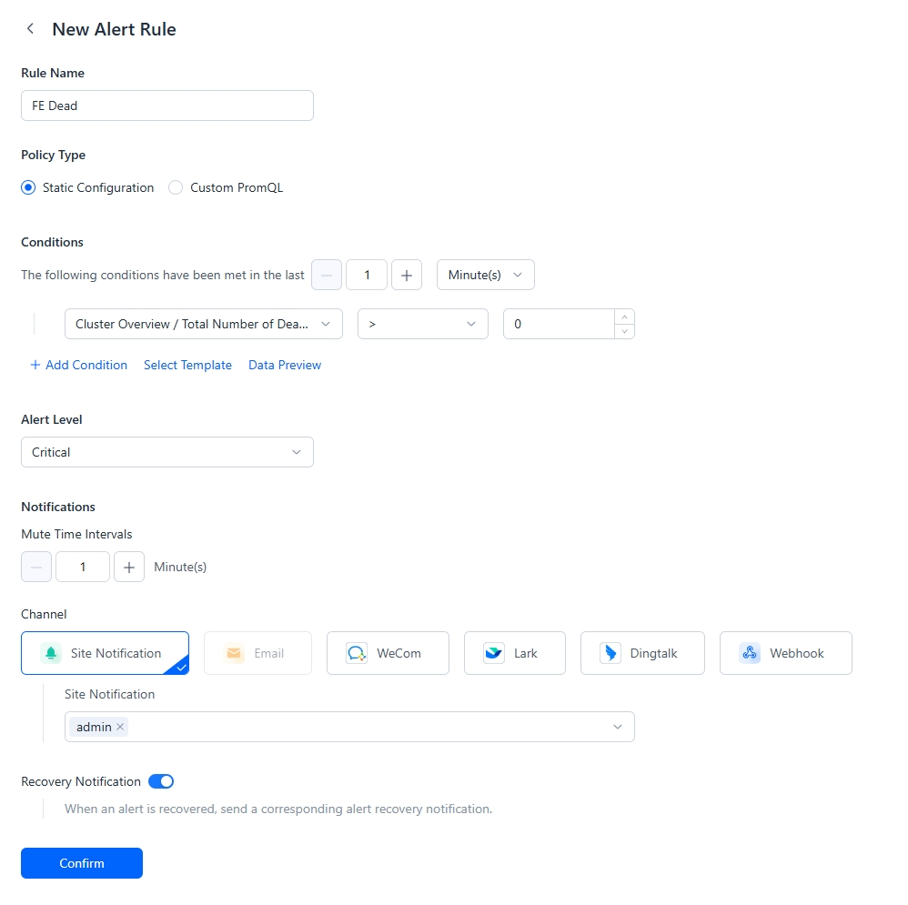

## 通知配信の設定

アラートルールは、サイト内通知、メール、IMツール、またはWebhook経由で通知を送信するように設定できます。

WeChat Work、DingTalk、FeishuなどのIMツールを使用する場合は、パブリックネットワークへの接続性を確保してください。

### サイト内通知

1.  **In-site Alertを選択**

    サイト内通知は、アラート通知内にアラート情報をプッシュします。サイト内プッシュユーザーを選択する必要があります。
    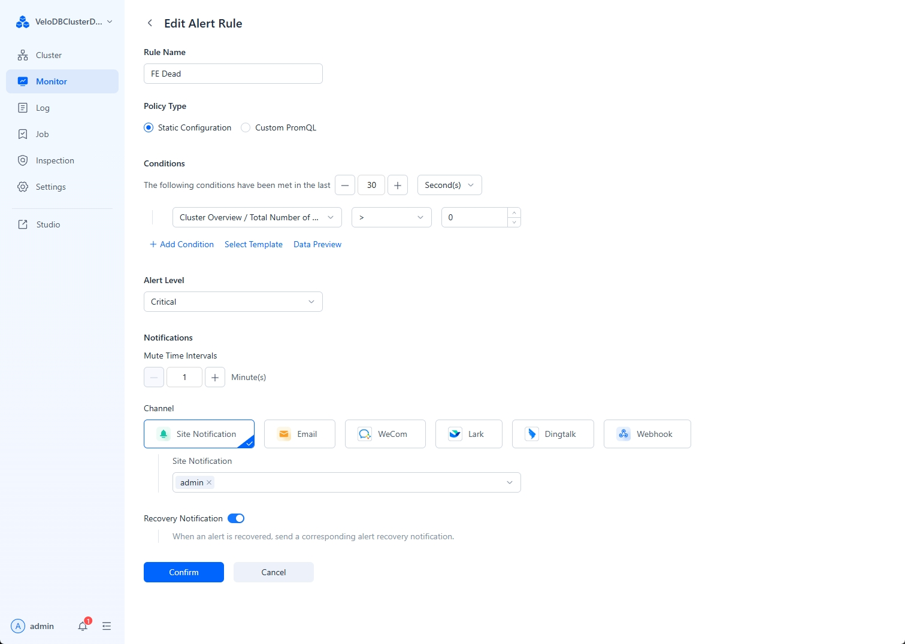

2.  **サイト内アラートの確認**

    アラートが発生した場合、左下の通知メニューでアラート情報を確認できます。
    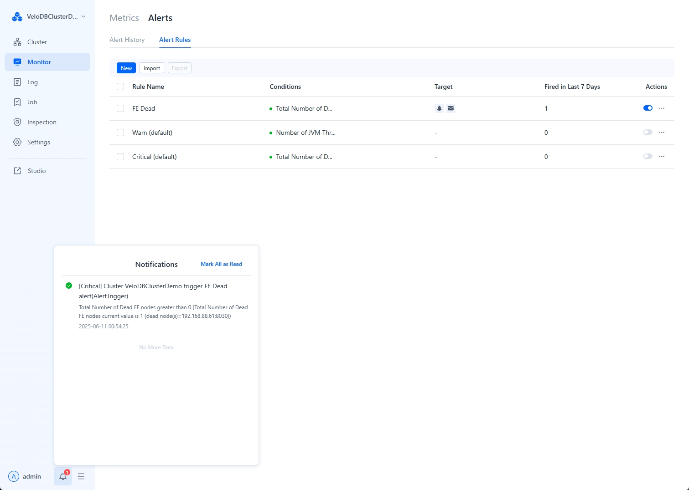

### メール

1.  **メールアラートの設定**

    ユーザーメニューで「Service Configuration」を選択して設定メニューに入ります。メールアラート情報を設定します。

    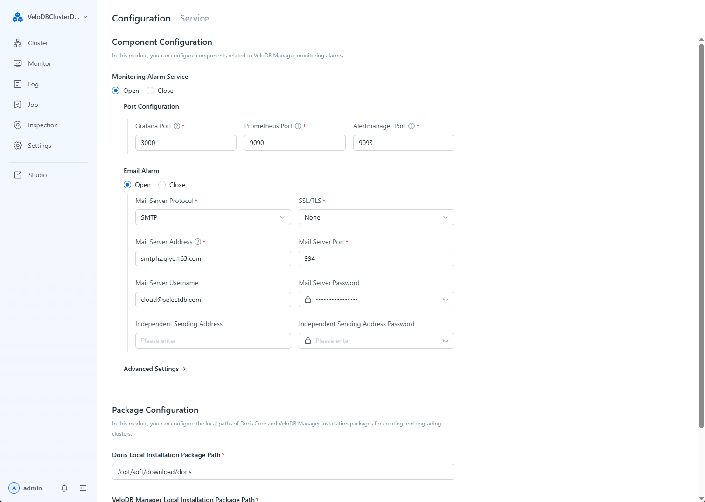

2.  **メール通知の選択**

    方法として「Email Notification」を選択し、アラートを受信するユーザーのメールアドレスを入力します。

    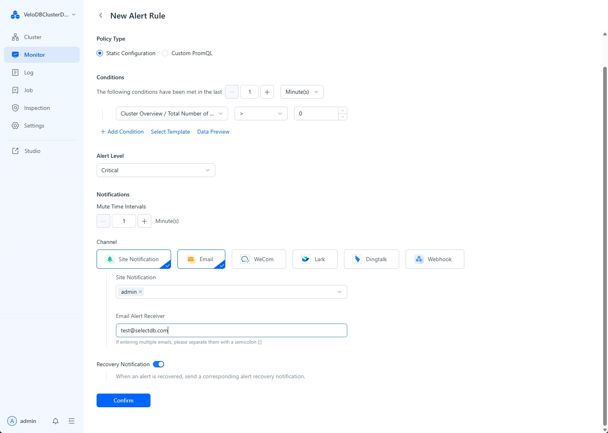

### WeChat Work

1.  **WeChat Workグループを作成してボットを追加**

    下の画像に示すように、WeChat Workボットを追加します：

    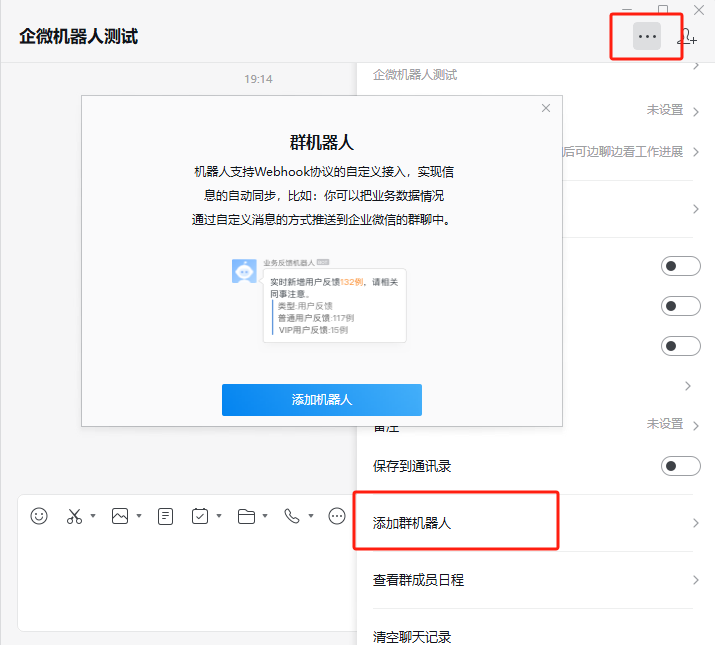

2.  **ボットWebhookをコピー**

    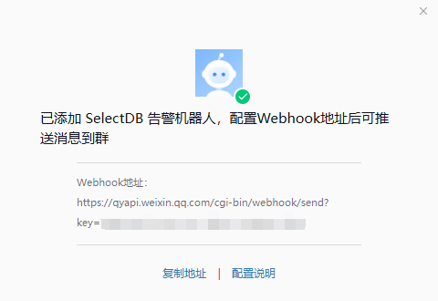

3.  **ManagerにボットWebhookを追加**

    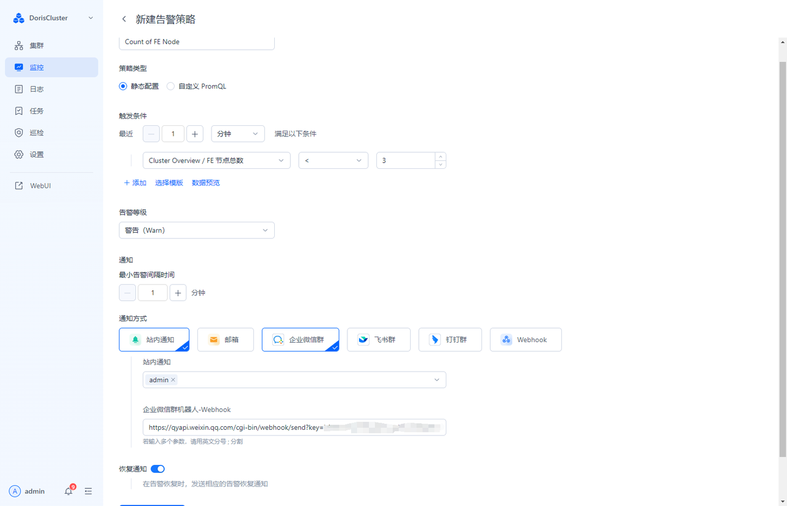

### DingTalk

1.  **DingTalkグループを作成してグループボットを追加**

    下の画像に示すように、グループ設定でDingTalkグループボットを作成します：

    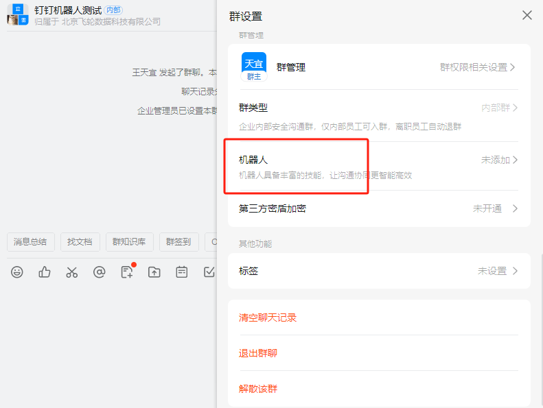

2.  **「Add Webhook Type Bot」を選択**

    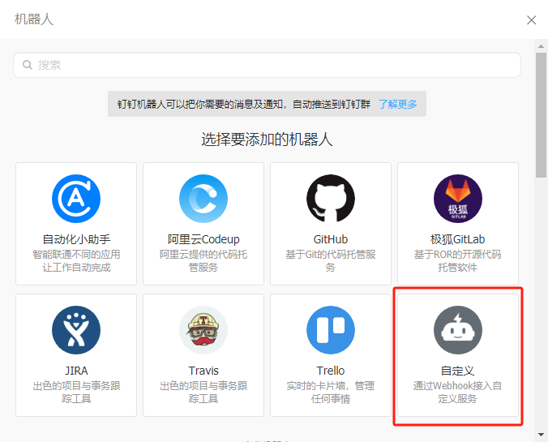

3.  **ボット用にキーワードを追加**

    DingTalkボットでは「Alert」と「告警」の両方のキーワードを追加する必要があります。そうでなければ、アラートを受信できません。

    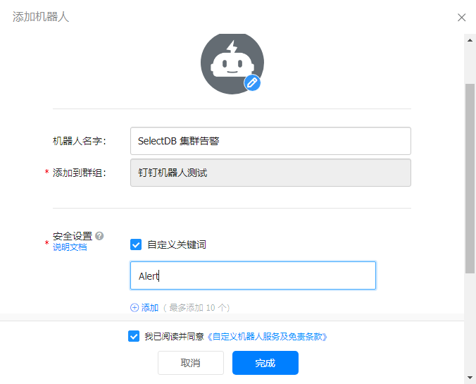

4.  **DingTalkボットWebhookをコピー**

    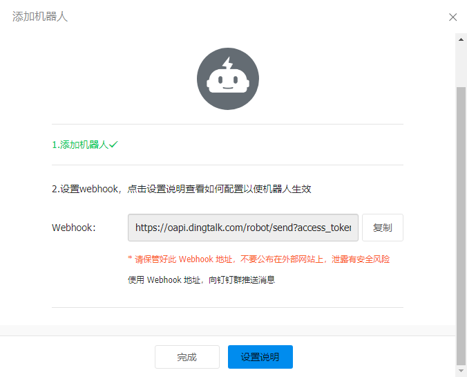

5.  **Manager用にDingTalkボットWebhookを設定**

    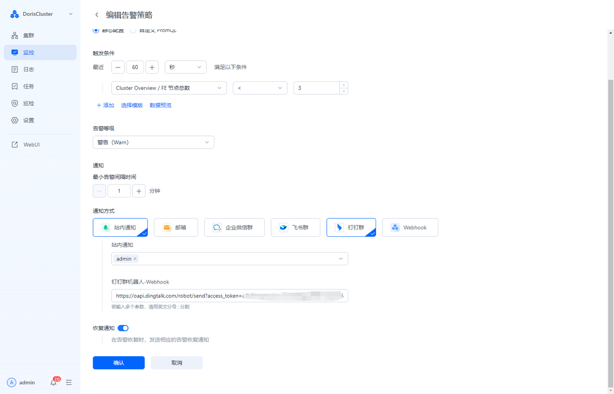

### Feishu

1.  **Feishuグループを作成してボットを追加**

    Feishuグループで「Custom Bot」を選択します：

2.  **Webhookアドレスをコピー**

    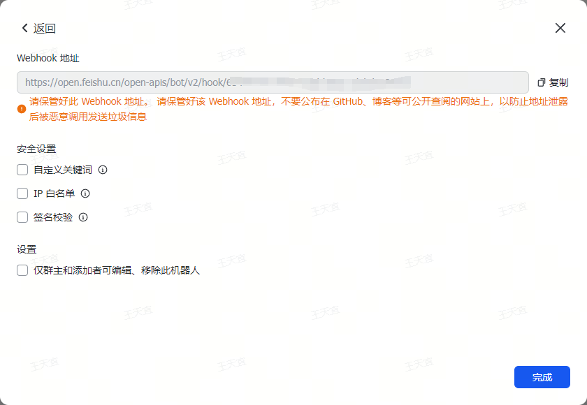

3.  **Managerアラート用にFeishuボットWebhookを設定**

    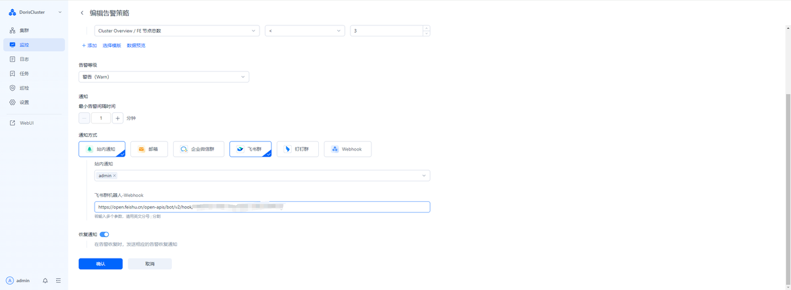

### Webhook

Webhook方式では、ユーザーがカスタムAPIを定義し、その完全なURLをManagerに提供できます。ManagerはこのAPIにアラートを送信し、ユーザーのAPIはアラートを受信すると他の処理を実行できます。

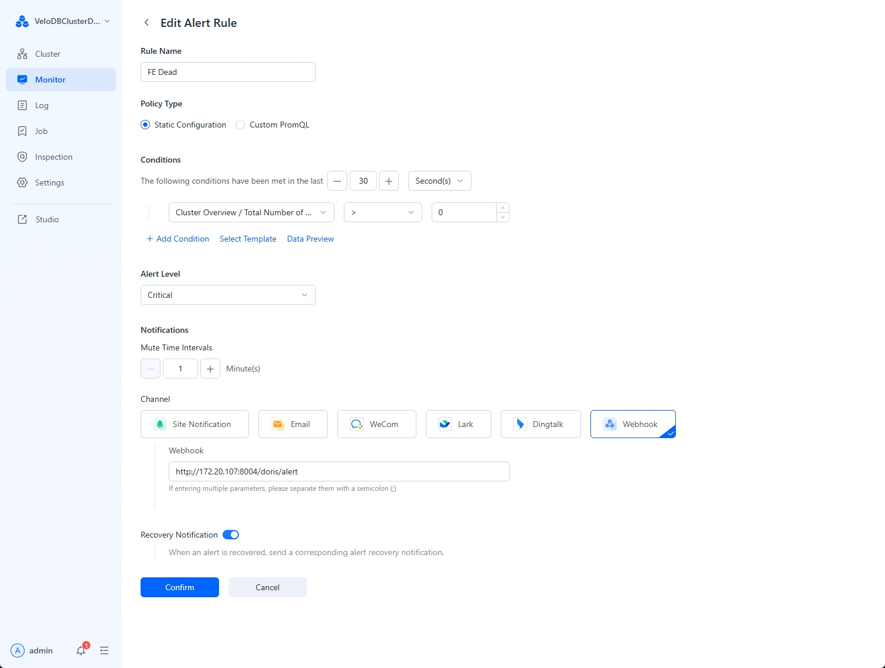

ManagerがユーザーのAPIに送信するボディコンテンツは以下の通りです：

```json
{
    "alertContent":"[cluster_guide]testrule1\nTime: 2023-12-15 17:32:56\nCluster: cluster_guide\nRule Name: testrule1\nAlert Content: FE Alive less than 50.0\n",
    "alertInfo":"FE Alive less than 50.0",
    "alertName":"testrule1",
    "cluster":"cluster_guide",
    "time":"2023-12-15 17:32:56"
}
```
