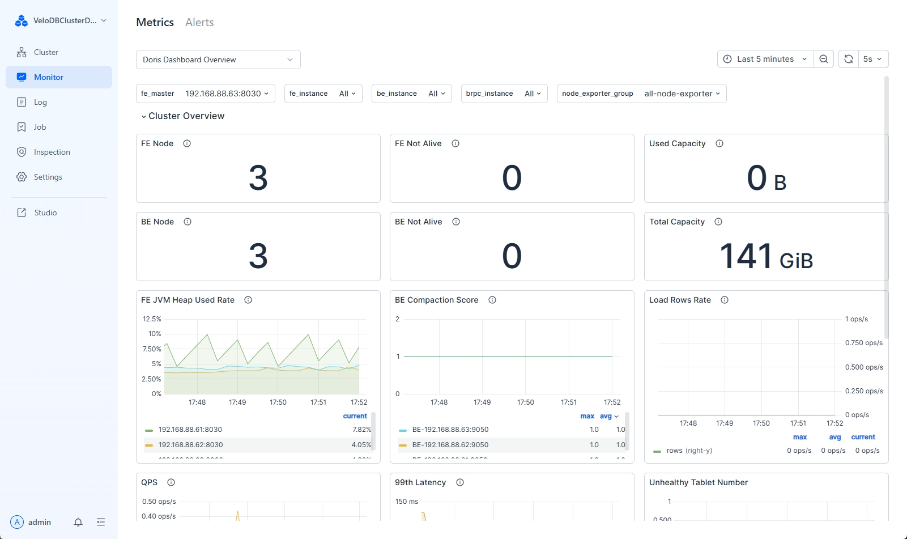
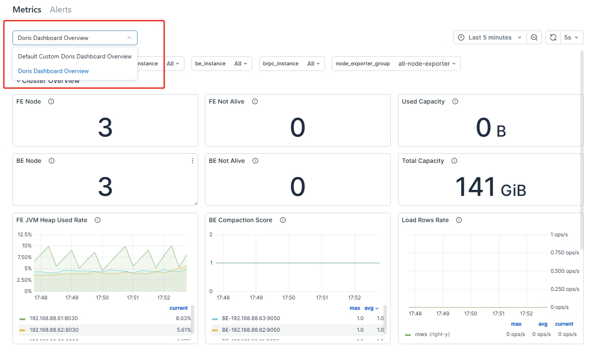
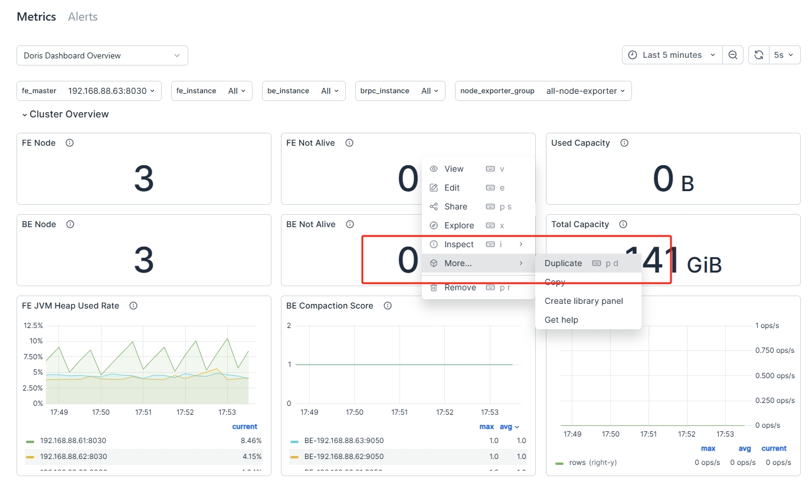
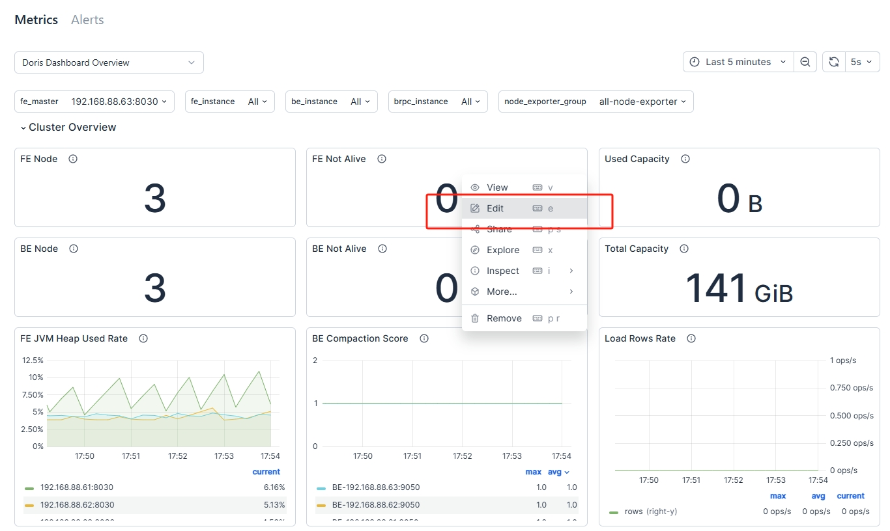
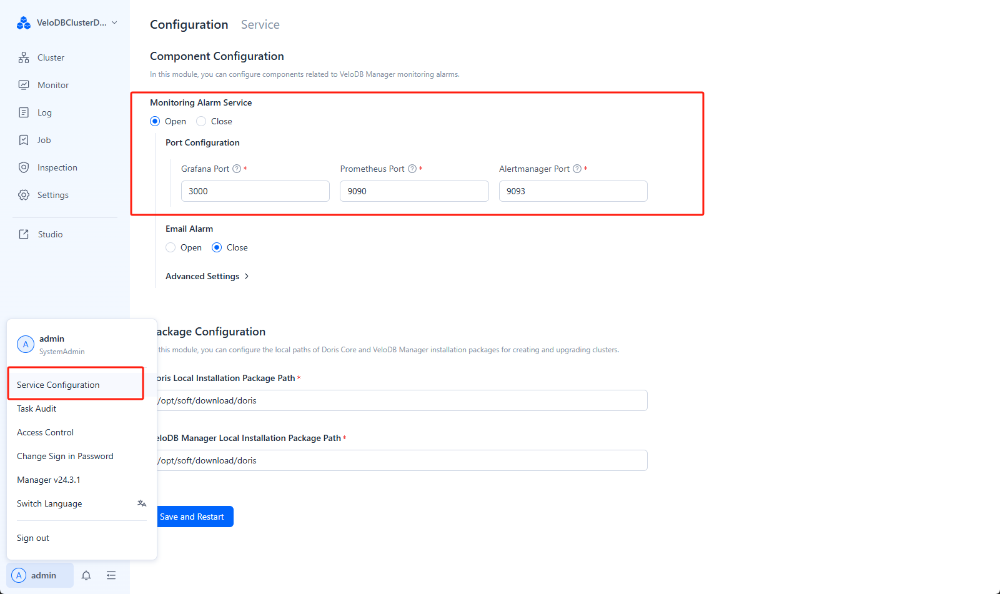

---
{
  "title": "Doris Cluster監視",
  "description": "Managerは、Prometheus、Grafana、およびAlertManagerを統合し、Manager内で直接クラスターモニタリングを表示および管理することを可能にします。",
  "language": "ja"
}
---
# Dorisクラスター監視

Managerは、Prometheus、Grafana、およびAlertManagerを統合しており、Manager内で直接クラスター監視を表示および管理できます。

## クラスター監視の表示

Managerは、クラスターのリアルタイムの運用状況を理解するのに役立つ豊富な事前定義済み監視メトリクスセットを提供します。

監視メトリクスの説明は以下の通りです：

| Category          | Metric Name                 | Metric デスクリプション                                   |
| :---------------- | :-------------------------- | :--------------------------------------------------- |
| Cluster 概要  | FE Node                     | クラスター内のFEノードの総数                                    |
|                   | FE Not Alive                | クラスター内のオフラインFEノード数                                |
|                   | Used Capacity               | クラスター内のBEの使用容量                                    |
|                   | BE Node                     | クラスター内のBEノードの総数                                    |
|                   | BE Not Alive                | クラスター内のオフラインBEノード数                                |
|                   | Total Capacity              | クラスター内のBEの総利用可能ストレージ容量                            |
|                   | FE JVM Heap Use Rate        | クラスター内のFEのJVMヒープ使用率                               |
|                   | BE コンパクション Score         | 各BEのCompactionスコア                                   |
|                   | Load Rows Rate              | 単位時間内のデータインポート状況                                  |
|                   | QPS                         | 異なるFEのQPS状況                                        |
|                   | 99th Latency                | 異なるFEの99パーセンタイルクエリレイテンシ                           |
| Host Monitor      | CPU Used Rate               | ノードのCPU使用率                                         |
|                   | Mem Usage                   | ノードのメモリ使用サイズ                                      |
|                   | Mem Used Rate               | ノードのメモリ使用率                                        |
|                   | I/O Util                    | 単位時間内のディスクI/O利用率                                  |
|                   | Disk Used Rate              | 使用されたディスク容量の割合                                    |
|                   | Disk Write Throughput       | ディスク書き込みスループット                                    |
|                   | Disk Read Throughput        | ディスク読み取りスループット                                    |
|                   | Network Outbound Traffic    | ゲートウェイのアウトバウンドトラフィック                              |
|                   | Network Inbound Traffic     | ゲートウェイのインバウンドトラフィック                               |
| Query Statistic   | RPS                         | 単位時間内の異なるFEの1秒あたりのリクエスト数                         |
|                   | QPS                         | 異なるFEのQPS                                          |
|                   | 99th Latency                | 99パーセンタイルクエリレイテンシ                                 |
|                   | Query Percentile            | クエリレイテンシ（異なるパーセンタイルでの）                            |
|                   | Query Error \[1m]           | 1分以内のクエリ失敗率                                       |
|                   | Connections                 | 各FEの接続数                                           |
| Jobs              | Broker Load Job             | Brokerロードタスクのステータス分布                              |
|                   | Insert Load Job             | Insertタスクのステータス分布                                 |
|                   | Routine Load Job            | Routineロードタスクのステータス分布                             |
|                   | Spark Load Job              | Sparkロードタスクのステータス分布                               |
|                   | Broker Load Tendency        | Brokerロードタスクのステータス傾向                              |
|                   | Insert Load Tendency        | Insertタスクのステータス傾向                                 |
|                   | Routine Load Tendency       | Routineロードタスクのステータス傾向                             |
|                   | Spark Load Tendency         | Sparkロードタスクのステータス傾向                               |
|                   | SC Job                      | 実行中のスキーマ変更タスク数                                    |
|                   | Report Queue Size           | マスターノードのReport Queue Size                          |
|                   | Rollup Job                  | 実行中のrollupタスク数                                     |
| Transactions      | Txn Begin/Success on FE     | FE上で開始されたトランザクションの総数と成功したトランザクション              |
|                   | Txn Failed/Reject on FE     | 単位時間内のBEトランザクションの失敗率と拒否率                         |
|                   | Publish Task on BE          | BE上のpublishタスクの総数                                 |
|                   | Txn Status on FE            | 異なる状態のトランザクション数                                   |
|                   | Txn Load Bytes/Rows rate    | 単位時間内にインポートされたデータの行数とサイズ                          |
| FE                | Max Replayed Journal ID     | FEのJournal ID                                       |
|                   | Edit ログ Size               | FEのEdit logサイズ                                     |
|                   | Image Write                 | FE上のイメージ書き込み数                                     |
|                   | Image Push                  | FE上のイメージプッシュ数                                     |
|                   | Image Counter               | FE上のイメージ書き込みおよびプッシュ数                             |
|                   | Image Clean                 | FEイメージクリーンアップの成功と失敗状況                            |
|                   | Edit log Clean              | FE edit logクリーンアップの成功と失敗状況                        |
|                   | BDBJE Write                 | BDBJEの99パーセンタイル書き込みレイテンシ                         |
|                   | BDBJE Read                  | 単位時間内のBDBJEの読み取り                                 |
|                   | JVM Heap                    | FEのJVMヒープ使用量                                      |
|                   | Scheduling Tablets          | データバランシングまたは復旧中にスケジューリングされるタブレット数               |
|                   | JVM Old GC                  | Old GC                                               |
|                   | JVM Young GC                | Young GC                                             |
|                   | JVM Old                     | JVM oldサイズ                                         |
|                   | JVM Young                   | JVM youngサイズ                                       |
|                   | FE Collect コンパクション Score | FEによって収集された各BEのCompactionスコア                      |
|                   | JVM Non Heap                | FEのJVM non-heap使用量                                |
|                   | JVM Threads                 | JVMスレッド数                                          |
| BE                | Disk Usage                  | BEのディスク容量使用率                                      |
|                   | BE FD Count                 | BE上のFD使用量                                         |
|                   | BE Thread Num               | BE上のスレッド分布                                        |
|                   | Tablet Meta Read            | 単位時間内のBEのメタデータ読み取り状況                             |
|                   | Tablet Meta Write           | 単位時間内のBEのメタデータ書き込み状況                             |
|                   | Tablet Distribution         | BE上のタブレット分布                                       |
|                   | BE コンパクション Base          | 単位時間内にBEによって実行されるbase compactionタスクの率            |
|                   | BE コンパクション Cumulate      | 単位時間内にBEによって実行されるcumulative compactionタスクの率      |
|                   | BE Push Bytes               | 単位時間内のBE上のpush_request_writeデータのサイズ             |
|                   | BE Push Rows                | 単位時間内のBE上のpush_request_writeの行数                  |
|                   | BE Scan Bytes               | 単位時間内にBEによってスキャンされたデータのサイズ                       |
|                   | BE Scan Rows                | 単位時間内にBEによってスキャンされた行数                            |
| BE Tasks          | Finish Task Report          | 各BE上で完了したタスクの総数                                   |
|                   | Push Task                   | 各BE上で正常に実行されたpushタスク数                            |
|                   | Push Task Cost Time         | 各BE上でpushタスクを実行する時間コスト                           |
|                   | Delete                      | BE上で実行されたdeleteタスクの総数                            |
|                   | Base コンパクション             | BE上で実行されたbase_compactionタスクの総数                    |
|                   | Cumulative コンパクション       | BE上で実行されたcumulative_compactionタスクの総数              |
|                   | Clone                       | BE上で実行されたcloneタスクの総数                             |
|                   | Create Rollup               | BE上で実行されたcreate_rollupタスクの総数                      |
|                   | Schema Change               | BE上で実行されたschema_changeタスクの総数                      |
|                   | Create Tablet               | BE上で実行されたcreate_tabletタスクの総数                      |

## 新しい監視ダッシュボードの作成

Managerには2つの監視ダッシュボードがあります：

* **Doris Dashboard 概要**: 基本的なDorisおよびホスト監視項目を提供する事前定義済みのDoris監視ダッシュボードで、変更はできません。

* **Default Custom Doris Dashboard 概要**: 変更可能なユーザー定義の監視ダッシュボードです。

新しいダッシュボードを作成する際は、**Default Custom Doris Dashboard 概要** パネルを変更してカスタムダッシュボードを追加できます。

1.  **「Default Custom Doris Dashboard 概要」ダッシュボードの選択**

    監視ページの左上隅で、「Default Custom Doris Dashboard 概要」パネルを選択します：

    

2.  **新しいダッシュボードの複製**

    新しいパネルを複製します。任意のモジュールにドラッグ&ドロップできます：

    

3.  **複製されたパネルの編集**

    パネルを編集します。ルールについては [edit panel](https://grafana.com/docs/grafana/latest/panels-visualizations/panel-editor-overview/) を参照してください。

    

## クラスター監視の管理

### クラスター監視の有効化/無効化

ユーザー設定で、「Service 構成」を選択して監視およびアラートサービスを有効または無効にします。

### 監視認証の有効化/無効化

Manager v24.0.3以降、監視コンポーネントの認証はデフォルトで有効になっています。Prometheus、AlertManager、およびGrafanaのアカウントとパスワードを個別に設定できます。`webserver/conf/manager.conf` ファイルで、以下の設定を変更できます：

| 構成       | タイプ    | デスクリプション                                                                                             |
| :------------------ | :------ | :------------------------------------------------------------------------------------------------------ |
| MONITOR\_AUTH\_ENABLE | BOOLEAN | 監視認証を有効または無効にします。デフォルトはTRUEです。                                                                      |
| GRAFANA\_USER       | STRING  | Grafanaのユーザー名。現在は'admin'ユーザーのみサポートされています。                                                         |
| GRAFANA\_PASS       | STRING  | Grafanaのパスワード。個別に設定されていない場合、ランダムパスワードが設定されます。                                                   |
| PROMETHEUS\_USER    | STRING  | Prometheusのユーザー名。デフォルトは'admin'ユーザーです。                                                              |
| PROMETHEUS\_PASS    | STRING  | Prometheusのパスワード。個別に設定されていない場合、ランダムパスワードが設定されます。                                              |
| ALERTMANAGER\_USER  | STRING  | AlertManagerのユーザー名。デフォルトは'admin'です。                                                               |
| ALERTMANAGER\_PASS  | STRING  | AlertManagerのパスワード。個別に設定されていない場合、ランダムパスワードが設定されます。                                            |
