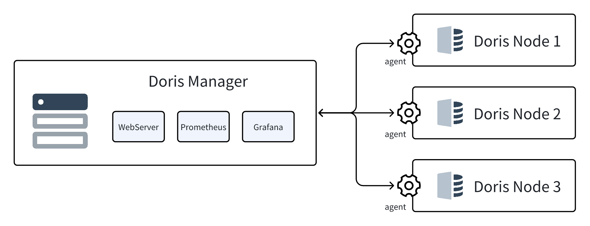

---
{
  "title": "Manager入門",
  "description": "Cluster Manager for Doris（以下、Managerと呼ぶ）は、ブラウザ・サーバー（BS）アーキテクチャベースのクラスター運用・保守ツールです...",
  "language": "ja"
}
---
# Manager の紹介

Cluster Manager for Doris（以下、Manager と称す）は、Doris/VeloDB 向けのブラウザ・サーバ（BS）アーキテクチャベースのクラスタ運用保守ツールで、クラスタの視覚的なインストール、デプロイ、管理を可能にします。

## Manager アーキテクチャ

Manager バージョン24.0以降、クラスタ管理においてserver-agentアーキテクチャを採用し、集中型から分散協調モードへと進化しています。これにより、大規模なクラスタ管理と複雑な運用保守シナリオをサポートします。AgentとServerはHTTPプロトコルを使用して直接通信し、データセキュリティのためにSSL暗号化と組み合わせることができます。サービスの全体的なアーキテクチャを以下に示します：

### Manager Web Server

Manager Web Serviceは、Managerウェブアプリケーションのサーバサイドであり、Apache DorisおよびVeloDB Dorisクラスタの自動運用保守のコアモジュールです。主な機能には以下が含まれます：

* **運用保守ハブ**: 組み込みメタデータストレージとWebサービスAPI。
* **セキュリティ制御システム**: ユーザ認証システムときめ細かな権限管理システムを統合。
* **自動運用保守プラットフォーム**: Webインターフェースを通じたDoris/VeloDBクラスタの視覚的な運用保守をサポート。

### Manager Agent

ManagerでDorisクラスタを管理するには、各クラスタノードにAgentをインストールする必要があります。デフォルトポートは8972で、Manager Web Serviceが配置されているマシンとのネットワーク接続性が必要です。Agentの主な機能には以下が含まれます：

* **指示実行ハブ**: サーバから発行された管理指示を受信・実行し、実行結果のフィードバックを同期します。
* **監視データパイプライン**: ホスト/Dorisプロセスメトリクスをリアルタイムで収集し、サーバの監視システムに能動的にレポートします。
* **クラスタヘルスプローブ**: 定期的にノードの生存状態とプロセス情報をレポートし、クラスタの可観測性を維持します。

## Manager 機能の概要

Managerは、以下の機能を含むDoris/VeloDBの全ライフサイクルの視覚的管理を提供します：

* **Deploy Cluster**: Managerを通じて物理マシンまたは仮想マシンにApache DorisまたはVeloDB Dorisクラスタをデプロイします。
* **Take Over Cluster**: 既存のApache DorisまたはVeloDB DorisクラスタをManagerに引き継いで運用、保守、監視を行います。
* **Cluster Details**: クラスタの実行状態、詳細、接続情報を表示します。
* **Cluster Scaling**: FEおよびBEノードのスケールアウトまたはスケールインを行います。
* **Cluster Upgrade**: クラスタバージョンをアップグレードし、完全ダウンタイムアップグレードとオンラインローリングアップグレードの両方のモードを提供します。ビジネスシナリオに基づいて適切なアップグレード方法を選択できます。
* **Cluster Restart**: クラスタ全体、FE、BE、および個別ノードで再起動操作を実行します。クラスタ再起動はローリング再起動と完全再起動の両方をサポートします。
* **Node Details**: ノードのリアルタイム状態とマシン情報を表示します。
* **Parameter Configuration**: ノードの設定ファイルのカスタム編集をサポートし、個別ノードではすべての実行パラメータの表示をサポートします。
* **Monitoring and Alerting**: 監視メトリクスを表示し、アラートルールを設定し、電子メール、チャットソフトウェア、Webhook、その他の方法によるアラート通知をサポートします。
* **Log Viewing**: FEおよびBEノードのログの表示とクエリをサポートし、クラスタ問題のオフライントラブルシューティングを促進します。
* **Task Auditing**: 操作時間、オペレータ、操作内容を含む各タスクの詳細情報の表示をサポートします。
* **Cluster Inspection**: マシンの状態とクラスタの運用状況の手動または定期的なワンクリックチェックをサポートし、パフォーマンスボトルネックを迅速に特定・特定し、修復提案を提供します。
* **WebUI**: データベース内のデータと情報の表示、SQLクエリ、データインポート、権限管理、その他の操作の実行をサポートします。
