---
{
  "title": "WebUI ガイド",
  "description": "VeloDB Enterprise WebUI（「WebUI」）は、データ開発シナリオ向けのデータ開発プラットフォームであり、データの管理と探索を支援します。",
  "language": "ja"
}
---
# WebUI ガイド

VeloDB Enterprise WebUI（"WebUI"）は、データ開発シナリオ向けのデータ開発プラットフォームであり、データの管理と探索を支援し、Navicatの代替として使用できます。

## 主な機能

* **ログイン**：WebUIで異なるデータベースユーザーを使用してクラスターにログインします。
* **データ**：データベース内のデータを表示および管理します。現在は表示をサポートしています。
* **クエリ**：
  * **SQLエディタ**：クエリ実行、クエリ履歴の表示、クエリの保存をサポートする使いやすいSQLクエリエディタです。
  * **ログ解析**：ログシナリオ向けに設計されたユーザーフレンドリーな解析ツールで、SQLフィルタリング、検索などの機能をサポートしています。
  * **セッション管理**：実行中のSQLクエリを管理し、ユーザーがSQLクエリを表示および終了できるようにします。
  * **クエリ監査**：ワンストップのクエリ履歴監査ツールで、スロークエリのフィルタリングとそのプロファイルの表示が可能です。
  * **ワークロード管理**：Workload Groupsの迅速な作成、編集、表示をサポートします。
* **権限**：データベース内のユーザーとロールを管理し、それらに権限を付与および取り消します。
* **インポート**：インポートタスクの表示とインポートタスクの操作をサポートします。

## 登録とログイン

### WebUIサービスの使用

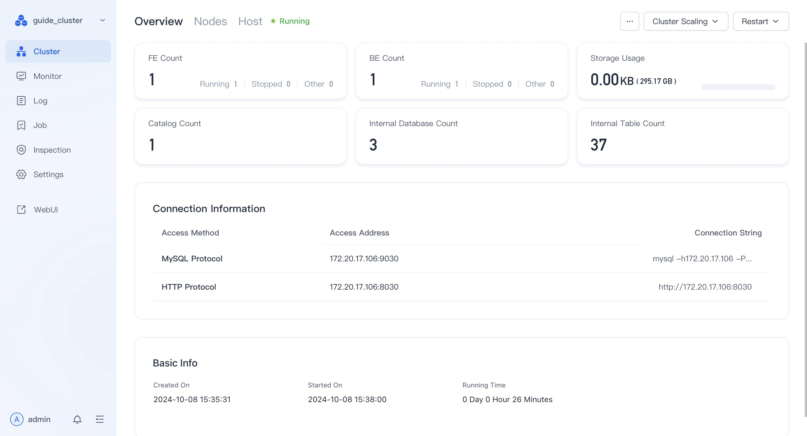

VeloDB ManagerでVeloDB-Dorisをデプロイしている場合、左側のサイドバーメニューにWebUIへの入り口を見つけることができます。

### WebUIへのサインイン

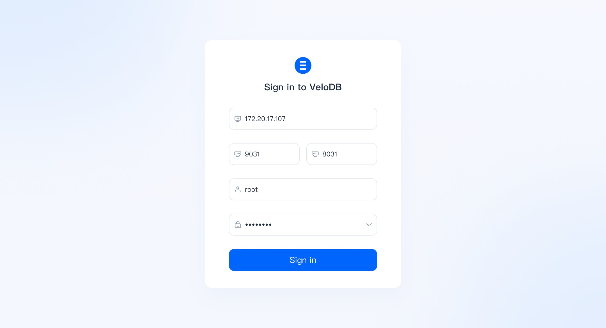

**FE IP、FE JDBCポート、FE HTTPポート、ユーザー名、パスワード**を入力する必要があります。

Managerからサインインリンクをクリックした場合、FE IP、FE JDBCポート、FE HTTPポートは事前に入力されているはずです。

WebUIにログインするためのユーザー名とパスワードは、データベースのものと同じです。クラスターのrootまたはadminパスワードを忘れた場合は、クラスターの設定モジュールで変更できます。

ログインアカウントとパスワードは記録されませんが、ブラウザに付属の記録機能を使用できます。

## データ

「データ」モジュールは、データベースを管理するWebUIの基本機能であり、主に2つの機能があります：

1、データとその組織形式を確認します。例えば、データベーステーブル構造、データサイズ、テーブル作成ステートメント、テーブルフィールド情報、データプレビューなど。

2、データの追加、削除、変更を行います。データベースオブジェクトの作成と削除、ストレージ戦略の変更などが含まれます。この部分の機能はまだ実装中で、一時的に利用できません。

データモジュールは、データベース内のデータの組織形式に応じて表示され、**Catalog** - **Database** - **Table** / **View**に分割されます。

### Catalog

Catalogはデータベースの集合です。

Catalogは内部catalogと外部catalogに分かれます。内部catalogはDoris独自のデータベースを含み、外部catalogはHive、Iceberg、Hudiなどに接続してクエリを実行できます。

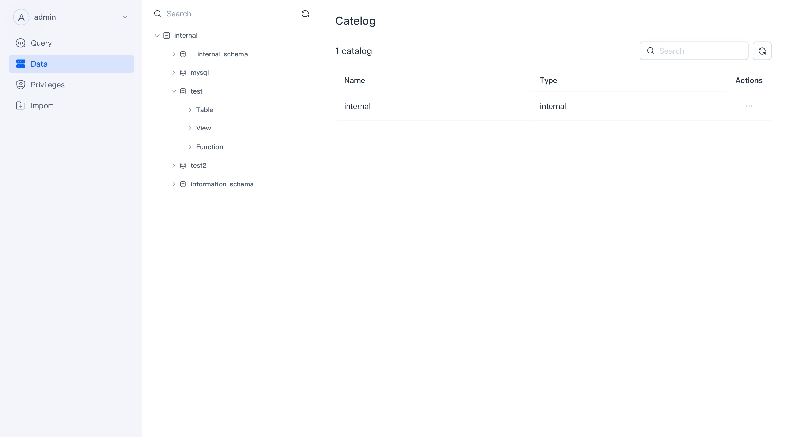

### Database

Databaseはテーブルとビューの集合です。DatabaseはCatalogに属します。

ディレクトリを選択すると、ディレクトリ下のデータベース、およびデータベースのサイズと変更時刻を表示できます。同時に、データベースの削除と新規作成ができます。

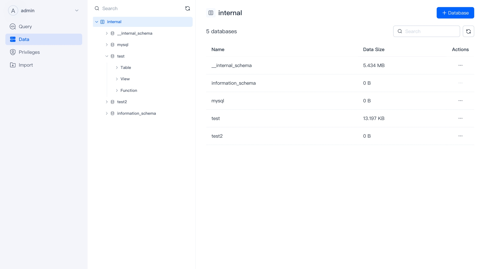

### Table

TableはVeloDBデータウェアハウスの基本単位で、TableはDatabaseに属します。

データベースが選択されると、データベース下のテーブル、およびテーブルのサイズ、作成・変更時刻を確認できます。

現在のバージョンでは、テーブルの削除ができ、将来のバージョンでは、WebUIでテーブルの作成とライフサイクル管理ができるようになります。

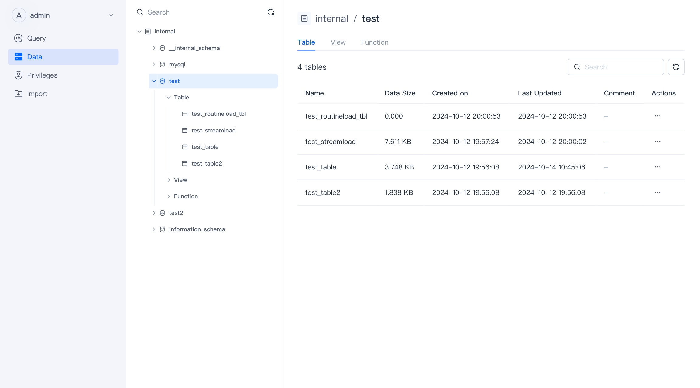

#### テーブル詳細

テーブル詳細ページでは、テーブル定義といくつかの基本属性を表示できます。

将来的には、ここでテーブルのライフサイクルの表示と管理をサポートし、より豊富なストレージ関連統計情報を提供する予定です。

将来、VeloDB WebUIは、ローカルファイルをテーブルにアップロードして軽量なテーブルインポート機能を完了することもサポートします。

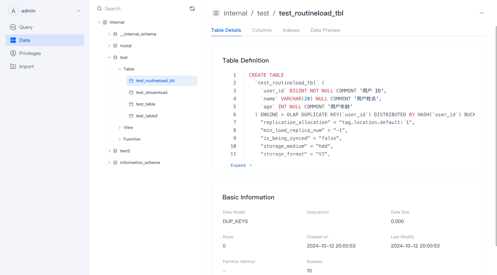

#### フィールド情報

ここでは、Base TableとそのRollupまたはマテリアライズドビューのフィールド情報を確認できます。

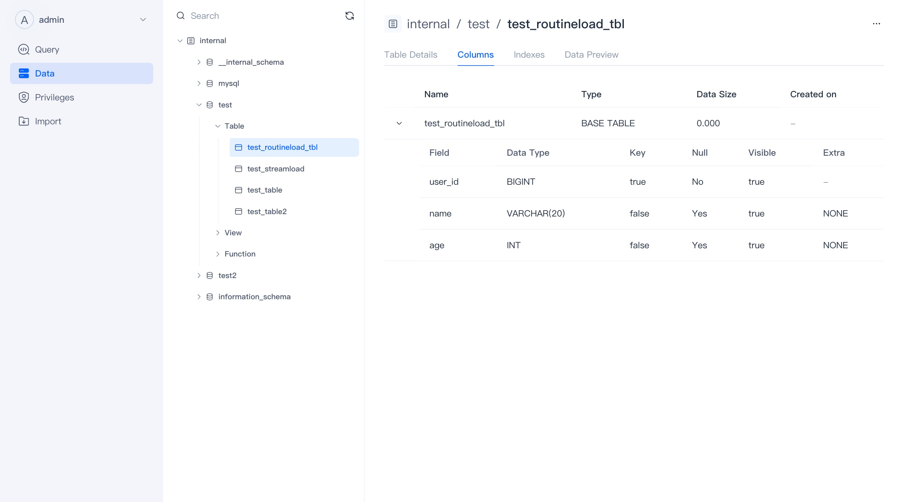

#### インデックス

ここはテーブル内のインデックス情報です。VeloDBには多くのインデックス様の高速化手法があります。ここでは、パーティション、プライマリキー、rollupは一時的にインデックスとして扱われず、Zonemap、Bloomfilter、Bitmap/Inverted Indexのみが表示されます。

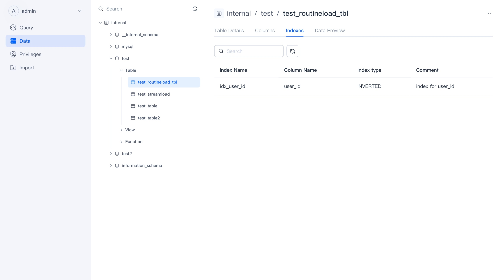

#### データ概要

概要の表示はクラスターリソースを消費するため、データ概要を表示するには利用可能なクラスターが必要です。

「合計 x データ」は、メタデータサービスから取得されるため、遅延が発生する可能性があり、実際のテーブル行数を反映していない場合があります。

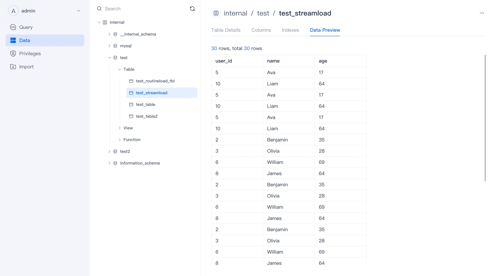

### View

Viewは、SQLステートメントの結果セットをテーブルベースで可視化したものです。WebUIでは、ビューをテーブルとは別に扱い、マテリアライズドビューはビューの範囲内ではありません。

ビューページは、テーブルページとほぼ同様で、ビューが持たない属性（インデックスや詳細など）は表示されません。

データをプレビューできますが、ビューデータのプレビューはクエリを開始し、クラスターリソースを消費します。

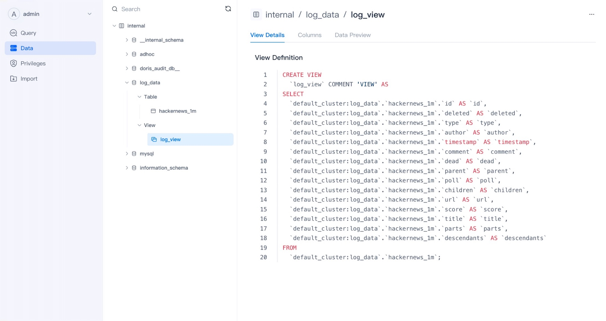

### Function

Functionは、クエリ、データ操作、またはストアドプロシージャ中に再利用できるCode Blockの一種です。Functionは入力パラメータを受け取り、計算結果を返します。複雑なクエリロジックを簡素化し、コードの可読性と保守性を向上させることができます。

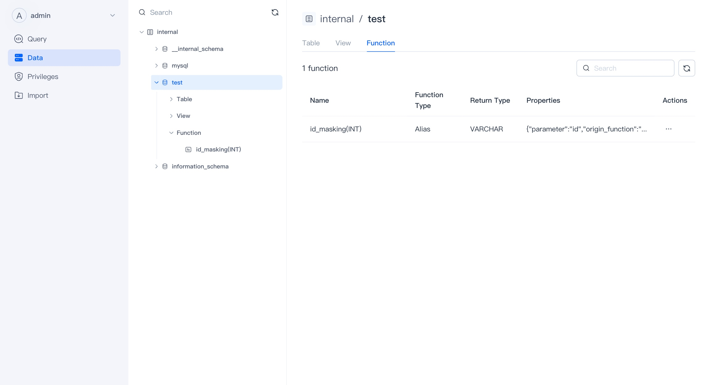

## クエリ

### SQLエディタ

クエリ結果は編集ボックスの下に返され、クエリによって返されるエラーまたは成功ステータスと情報もクエリ結果に表示されます。

同時に、ドロップダウンボタン**Run (LIMIT 1000)**をクリックして**Run and Download**に切り替えると、クエリ結果をダウンロードできます。

> **リマインダー** 現在、一度に複数のクエリが実行される場合、**最初の**クエリの結果が返され、後のバージョンで他の戻り値を表示する機能を追加する予定です。

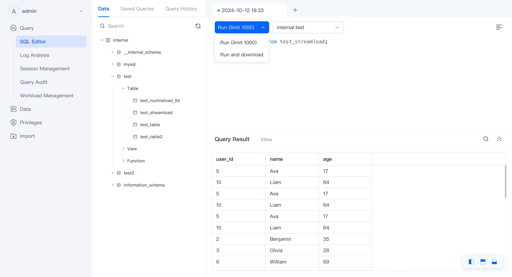

クエリ履歴のQuery IDをクリックして、クエリ詳細を表示できます。

> **注意** 非クエリステートメントや失敗したステートメントにはQuery IDがありません。

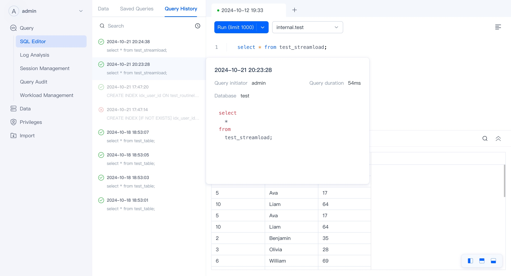

デフォルトでは、WebUIで開始されるクエリに対してクエリプランが有効になっており、これは単一クエリのパフォーマンスには影響しません。「Query Statement」をクリックして実行計画ページに入ります。

SQLエディタで作成するタブと開始するクエリは自動的に保存されます。タブをダブルクリックして保存されたSQLのタイトルを変更できます。Saved Queriesでは、保存されたクエリを表示して再度開くことができます。

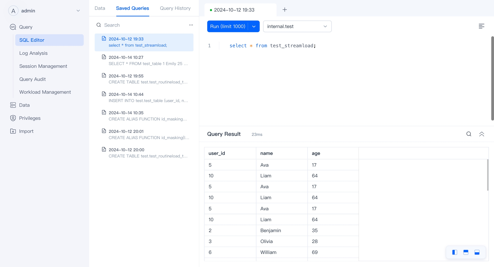

### セッション管理

セッション管理は、データベースまたはデータ分析環境でのアクティブなSQLセッションの管理を扱います。現在実行中のすべてのSQLクエリを表示し、問題を引き起こしているまたは予想より長く実行されているクエリを終了（kill）するオプションがあります。

これにより、管理者がリソース使用量を管理し、重要なクエリを優先させることができ、システムパフォーマンスが向上します。また、実行時間、クエリを開始したユーザー、利用されているリソースなど、各セッションに関する詳細情報を提供します。

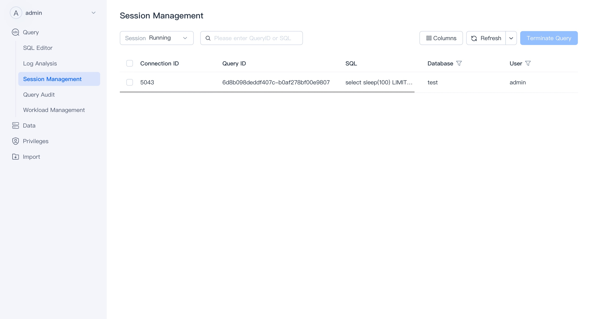

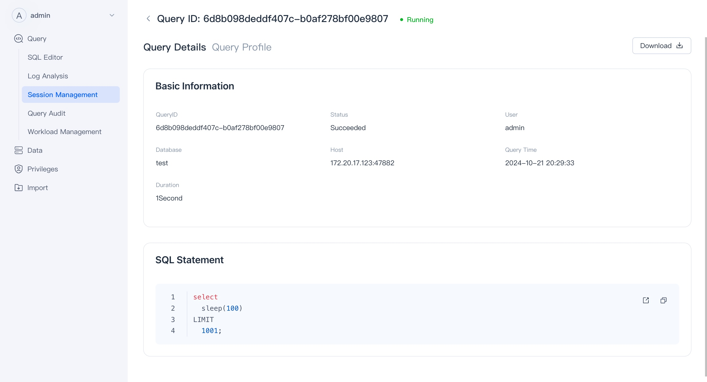

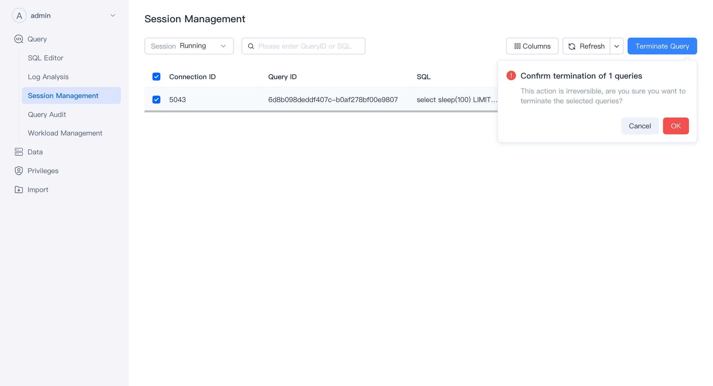

### クエリ監査

クエリ監査は、システムで実行されたクエリの履歴を監査・分析するための包括的なツールです。ユーザーがパフォーマンスの低いクエリをフィルタリングして特定できるようにし、これはデータベースパフォーマンスの最適化に不可欠です。

このツールには、各クエリの実行計画とリソース使用量に対する深い洞察を提供するプロファイリング機能が含まれています。これは、クエリパフォーマンスの追跡、トレンドの発見、時間の経過に伴う問題の診断のためのワンストップソリューションとして機能します。

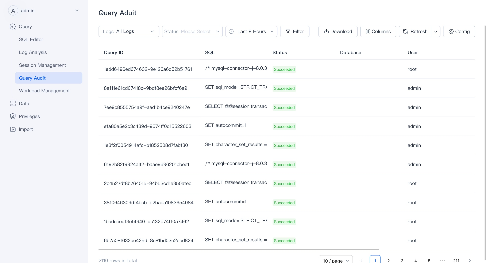

### ワークロード管理

ワークロード管理は、Workload Groupsの迅速な作成、編集、表示をサポートします。Workload Groupsは、クラスター内のクエリとインポート負荷のCPU/メモリ/IOリソース使用量を管理し、クラスター内のクエリの最大同時実行数を制御するために使用できます。

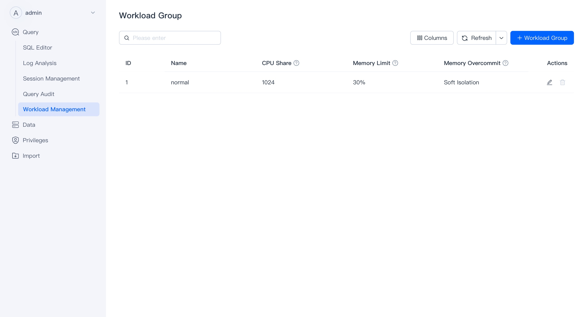

Admin権限を持つユーザーは、ワークロードグループを作成、変更、削除できます。

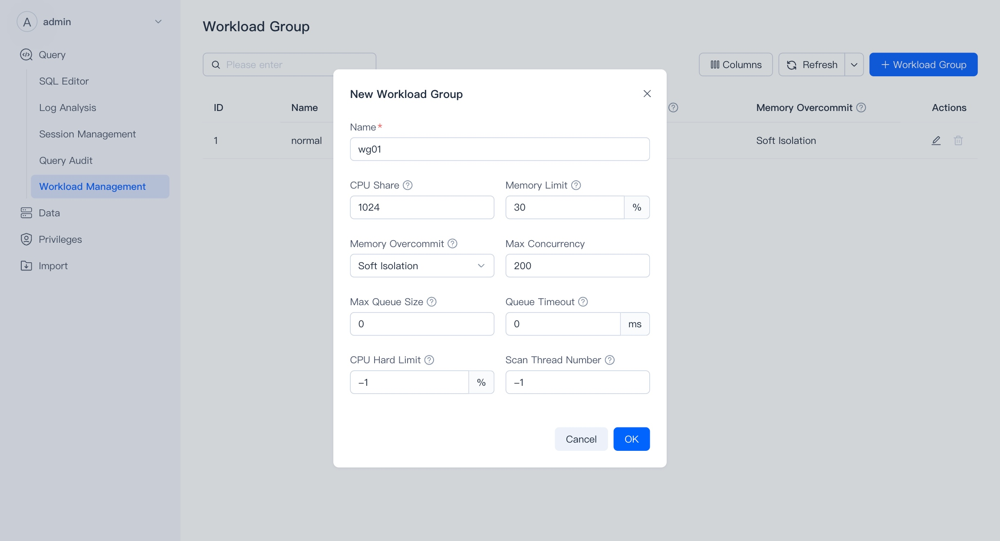

## 権限

### ユーザー

VeloDBクラスター内のユーザーを表示します。

Admin権限を持つユーザーのみが他のユーザーを追加・変更できます。

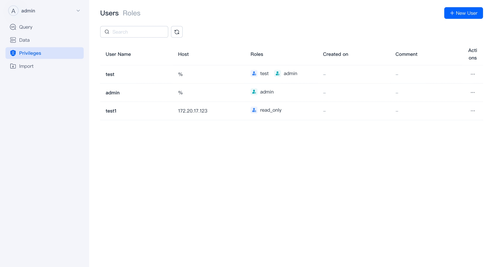

このページで新しいユーザーを作成できます。ユーザー名を除いて、他のコンテンツはオプションです。ただし、セキュリティ強化のため、ユーザーにパスワードを追加し、ホストへのアクセスを制限することを強く推奨します。

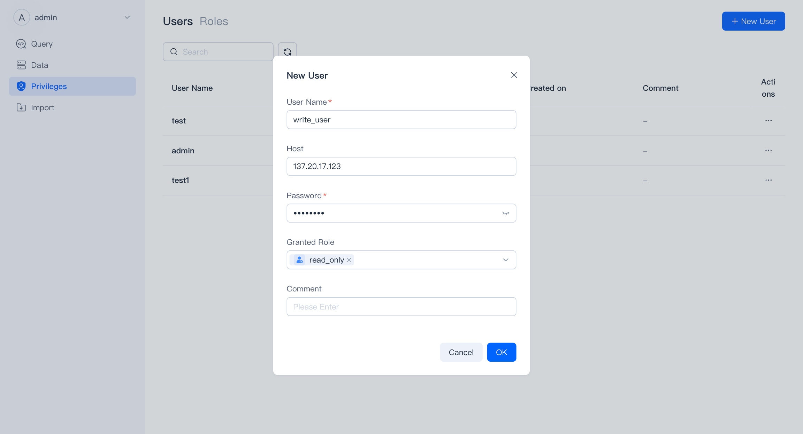

### ロール

ここでVeloDB内のロールを管理し、ロールに対する認可操作も実行できます。

Admin権限を持つユーザーのみが他のロールを追加・変更できます。

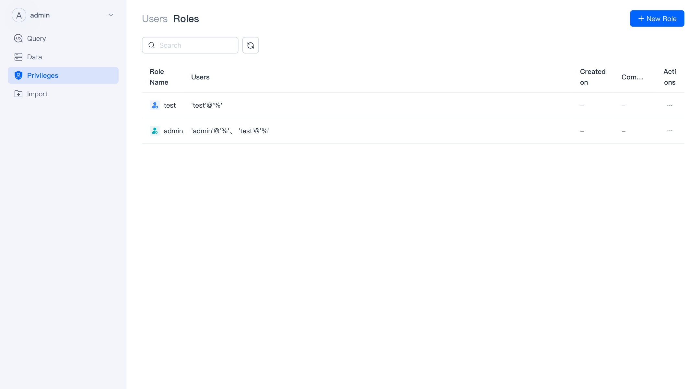

### 認可

ユーザーまたはロールの詳細ページで、認可/取り消し操作を実行できます。

認可/取り消し作業を実行するには、Adminまたは対応するレベルでのGrant権限を持っている必要があります。

WebUIでは、権限を3つのカテゴリに分けています：

* **Global：** グローバル権限はGlobalレベルでの権限です。グローバル権限があると、データベース内のすべての対応するオブジェクトに対する対応する権限が自動的に付与されます。
* **Data：** データリソースの権限を指します。レベルに応じて認可できます。親レベルの権限があると、その子コンテンツの対応する権限が自動的に付与されます。
* **Resource：** rootまたはadminユーザーのみがリソースを作成できます。現在サポートされている外部リソースには、Spark、ODBC、S3、JDBC、HDFS、HMS、ESが含まれます。

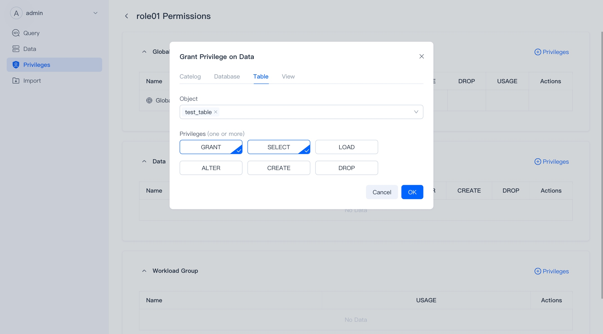

## インポート

インポートモジュールで、対応するデータベースのインポートタスクのリストを表示し、これらのインポートタスクに対する関連操作を実行できます。

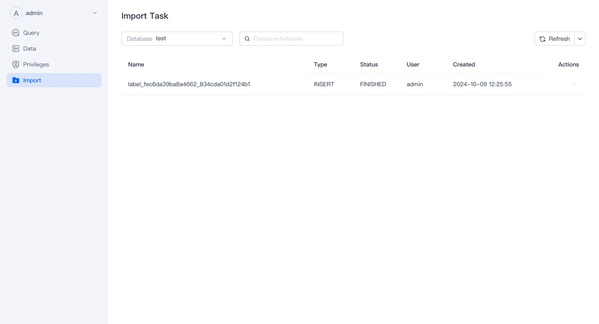

インポートタスクの名前をクリックして、インポートタスクの詳細を表示します。

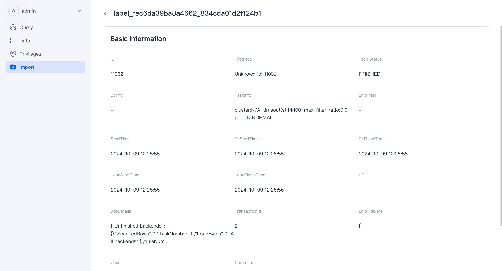
